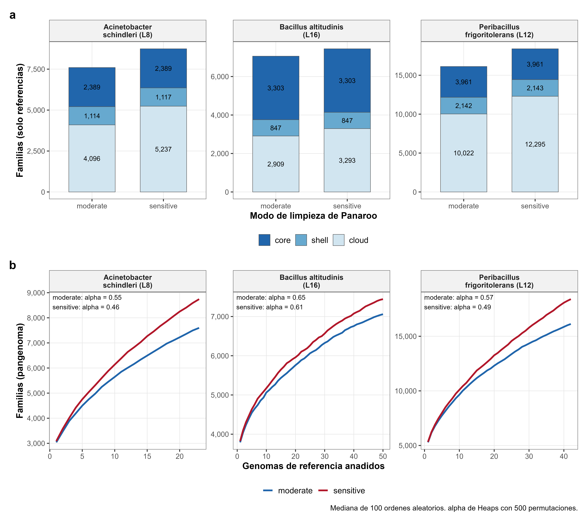
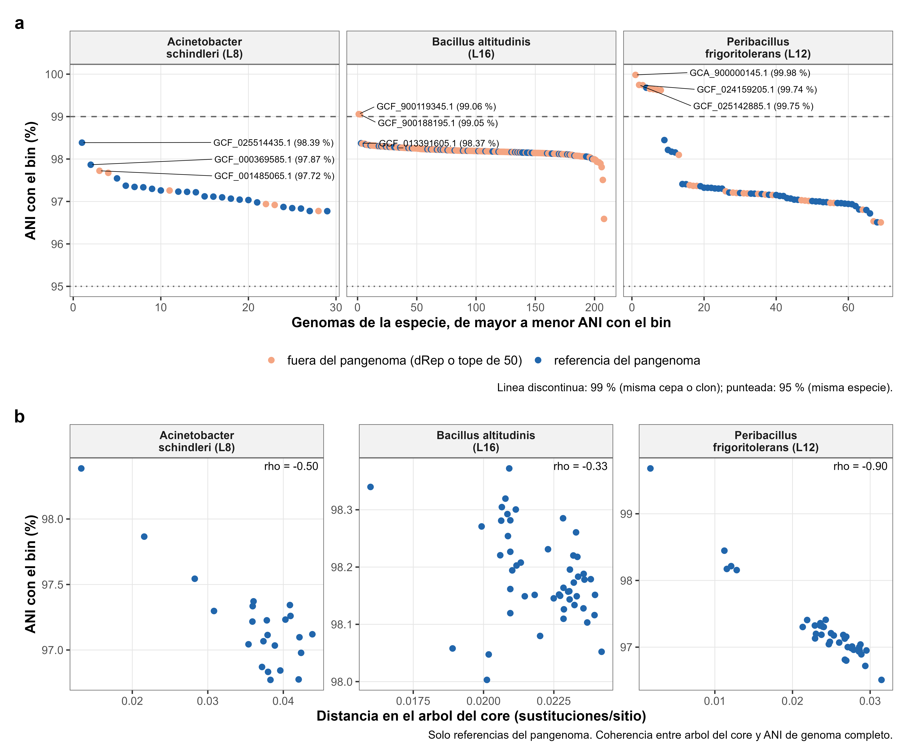

# Fase 3 - Resultados del analisis pangenomico

Documento unico de resultados de la Fase 3 (objetivo especifico 3, OE3) del
proyecto sobre la Estela de Raimondi. Reune la descripcion de los resultados,
la explicacion de cada figura y el analisis critico (que se sostiene, que se
corrigio y que queda abierto). Reemplaza a los documentos anteriores
`phase3_guia_resultados.md` y `phase3_analisis_critico.md`.

**Estado (08-10-2026).** Estan completos el censo, la seleccion de
referencias, la anotacion, el pangenoma (y su sensibilidad al modo de
Panaroo), los arboles del core, el ANI de los bins y las figuras 1-13. La
verificacion de genes especificos de la cepa se esta repitiendo con
correcciones (version 2): la parte local termino y la remota (F5, F5b y F6)
sigue en curso tras la correccion del 08-10 (seccion 3.3, paso 11). **Las
cifras finales de genes especificos (secciones 9.4-9.6, figuras 14-16) estan
pendientes** y se marcan como tales.

La seccion 3 documenta el flujo completo tal como se corrio: cada paso con su
script, parametros, recursos, fechas, controles y salidas.

Convencion de escritura: este repositorio usa solo caracteres ASCII (sin
tildes) para que los archivos se lean igual en Windows y Linux.

---

## Indice

1. Que pregunta responde la Fase 3
2. Glosario y abreviaturas
3. Flujo de trabajo, parametros y ejecucion
4. Seleccion de especies y de genomas de referencia
5. El pangenoma de cada especie
6. Donde cae cada cepa de la Estela dentro de su especie
7. Arboles del genoma core
8. Contenido accesorio, parentesco y habitat
9. Genes especificos de la cepa
10. Lo que se puede afirmar y sus limites
11. Pendientes
12. Referencias

---

## 1. Que pregunta responde la Fase 3

En la Fase 1 se reconstruyeron genomas bacterianos a partir del ADN de la
superficie de la Estela (bins o MAGs, ver glosario) y en la Fase 2 se les
asigno especie. La Fase 3 compara cada bin con los genomas publicos de su
misma especie para responder tres preguntas:

1. Como es el repertorio de genes de la especie: cuanto es comun a todas sus
   cepas y cuanto varia (pangenoma).
2. Donde cae la cepa de la Estela dentro de esa variacion: a que cepa conocida
   se parece y cuanto.
3. Que genes tiene la cepa de la Estela que ninguna otra cepa conocida de su
   especie tiene (genes especificos de la cepa). Esa lista pasa a la Fase 4,
   que analiza su funcion.

Especies analizadas (las tres con mas genomas publicos disponibles, seccion 4):

| Linaje | Especie | Bin de la Estela | Completitud del bin |
|---|---|---|---:|
| L16 | *Bacillus altitudinis* | bin-5-63 | 72,5 % |
| L12 | *Peribacillus frigoritolerans* | bin-1-54 | 92,3 % |
| L8 | *Acinetobacter schindleri* | bin-4-52 | 99,9 % |

"Linaje" (L16, L12, L8) es el codigo que la Fase 2 dio a cada grupo de bins de
la misma especie.

---

## 2. Glosario y abreviaturas

### 2.1 Abreviaturas

| Abreviatura | Significado |
|---|---|
| aa | aminoacidos (largo de una proteina) |
| pb, kb, Mb | pares de bases, miles y millones de pares de bases (largo de ADN) |
| ADN, GC | acido desoxirribonucleico; GC = proporcion de bases G y C de una secuencia. Cada especie tiene un GC tipico; un fragmento con GC muy distinto suele venir de otro organismo |
| CDS | secuencia codificante: tramo de ADN que se traduce a una proteina (un "gen" en este documento) |
| MAG | genoma ensamblado a partir de un metagenoma (*metagenome-assembled genome*). En este proyecto se llama tambien **bin** |
| QC | control de calidad |
| GTDB | *Genome Taxonomy Database*: taxonomia de bacterias basada en genomas completos. Se uso la version R220 |
| GTDB-Tk | programa que asigna especie GTDB a un genoma (Fase 2) |
| NCBI | *National Center for Biotechnology Information* (EE. UU.): bases de datos publicas de genomas y proteinas |
| ANI | identidad nucleotidica promedio entre dos genomas (*average nucleotide identity*) |
| dRep | programa que agrupa genomas casi identicos y deja uno por grupo (desreplicacion) |
| Bakta | programa que anota genomas: encuentra los genes y les asigna funcion |
| Panaroo | programa que construye el pangenoma: agrupa los genes de todos los genomas en familias |
| IQ-TREE | programa que construye arboles filogeneticos por maxima verosimilitud |
| UFBoot | *ultrafast bootstrap*: soporte de cada rama de un arbol de IQ-TREE (0-100) |
| BLAST | familia de programas que buscan secuencias parecidas en una base de datos. blastp: proteina contra proteinas; blastn: ADN contra ADN; tblastn: proteina contra ADN traducido |
| nr | base de NCBI con todas las proteinas conocidas, sin duplicados (*non-redundant*) |
| core_nt | base de NCBI con secuencias de ADN de genomas, sin las redundantes |
| IPG | *Identical Protein Groups* de NCBI: para una proteina, la lista de todos los genomas que la contienen identica |
| UniProtKB | base de proteinas de UniProt (Europa); se uso como comparacion |
| EBI | Instituto Europeo de Bioinformatica, que ofrece BLAST contra UniProtKB |
| COG, KEGG, EC, GO | sistemas de clasificacion de la funcion de un gen (categorias funcionales, rutas metabolicas, enzimas, ontologia de genes) |
| PCoA | analisis de coordenadas principales: dibuja en 2D genomas parecidos cerca |
| PERMANOVA | prueba estadistica de si un factor explica diferencias entre grupos de genomas |
| HGT | transferencia horizontal de genes (*horizontal gene transfer*) |
| T0, T1, T2 | niveles de prioridad de las referencias (seccion 4.2) |

### 2.2 Conceptos

| Termino | Significado en este trabajo |
|---|---|
| Bin / MAG | Genoma de una bacteria de la Estela reconstruido a partir de ADN mezclado. Puede estar incompleto: que un gen falte en el bin no prueba que la bacteria no lo tenga |
| Completitud | Porcentaje estimado del genoma que el bin contiene (CheckM2, Fase 1) |
| Referencia | Genoma publico de la misma especie, de buena calidad, usado para construir el pangenoma |
| Familia de genes | Grupo de genes que Panaroo considera "el mismo gen" en distintos genomas, por parecido de secuencia y por los genes vecinos. Es la unidad que se cuenta |
| Pangenoma | Todas las familias presentes en al menos uno de los genomas de la especie |
| Core | Familias presentes en al menos el 95 % de las referencias: lo que comparten (casi) todas las cepas |
| Shell | Familias en el 15-95 % de las referencias |
| Cloud | Familias en menos del 15 % de las referencias: genes raros |
| Accesorio | Shell + cloud: lo que varia entre cepas |
| Singleton | Familia presente en una sola referencia |
| Pangenoma abierto / cerrado | Abierto: cada genoma nuevo sigue aportando familias nuevas. Cerrado: tras cierto numero de genomas ya no aparecen familias nuevas |
| Ley de Heaps, alpha | Ajuste de cuantas familias nuevas aporta el genoma numero n: nuevas ~ k x n^(-alpha). alpha < 1 indica pangenoma abierto; cuanto menor, mas abierto. Es un resumen estadistico de la muestra de genomas, no una propiedad fija de la especie (Guerra 2026) |
| ANI >= 95 % / >= 99 % | Umbrales usuales: >= 95 % = misma especie; >= 99 % = practicamente la misma cepa o un mismo clon |
| Clon | Grupo de cepas casi identicas (ANI >= 99 %) que descienden de un ancestro reciente comun |
| Desreplicacion | Agrupar genomas con ANI >= 99 % y quedarse con uno por grupo, para que una cepa muy secuenciada no pese de mas |
| Distancia patristica | Suma de las ramas del arbol entre dos genomas, en sustituciones por sitio del genoma core. 0,0017 equivale a ~99,8 % de identidad en el core |
| Transferencia horizontal | Adquisicion de ADN de otro organismo, no heredado del ancestro. Suele viajar en elementos moviles |
| Elemento genetico movil | ADN que se mueve entre genomas: profagos (virus integrados en el cromosoma), transposones, secuencias de insercion (IS) e islas con integrasa |
| Integrasa, transposasa | Enzimas que insertan elementos moviles en el cromosoma; su presencia junto a un gen es una pista de que ese gen llego por transferencia horizontal |
| Gen candidato | Gen del bin que podria ser propio de la cepa: su familia no esta en ninguna referencia, o Panaroo lo elimino (seccion 9.3) |
| Gen especifico de la cepa | Candidato que pasa todos los filtros de la seccion 3.4: bien formado y sin copia parecida en ningun otro genoma conocido de la especie. Antes se llamaba "exclusivo verificado" |

---

## 3. Flujo de trabajo, parametros y ejecucion

Esta seccion describe cada paso tal como se corrio: que entra, que script lo
hace, con que parametros, donde y cuando se corrio, que control se aplico y
que salio. Los comandos completos para reproducirlo estan en
[README_fase3.md](../../README_fase3.md); aqui se documenta la corrida real de
este proyecto (04 al 08-10-2026).

### 3.1 Esquema general

```
Fase 2: 21 genomas en 19 linajes (12 con nombre de especie)
   |
[1]  Censo en GTDB R220 + QC de genomas publicos ..... 12 especies -> 7 viables (>= 15 post-QC)
   |
[2]  Descarga desde NCBI + verificacion .............. 660 solicitados, 660 verificados,
   |                                                   4 excluidos a mano (D30) -> 656
[3]  Clasificacion: nivel, habitat y continente ...... 656 genomas, 219 fuentes distintas
   |
[4]  Desreplicacion con dRep al 99 % ANI ............. 656 -> 137, 42, 23, 12, 4, 4 y 1 no redundantes
   |
[5]  Ranking y seleccion de referencias .............. 3 especies: 50 + 42 + 23 = 115 referencias
   |                                                   + 3 bins = 118 genomas
[6]  Piloto P0 (3 referencias + bin de L16) .......... aprobado
   |
[7]  Anotacion con Bakta ............................. 118/118 anotados, 0 alertas
   |
[8]  Pangenoma con Panaroo + particion ............... 7 059, 16 125 y 7 599 familias
   |    (solo con referencias)
[9]  Arbol del core con IQ-TREE ...................... 3 arboles, modo completo
   |
[10] Genes especificos, parte local (F1-F4) .......... v2: 46, 41 y 171 candidatos -> 14, 1 y 97 a F5
   |
[11] Genes especificos, parte remota (F5, F5b, F6) ... v1 terminada; v2 pendiente
   |
[12] Analisis complementarios ........................ ANI de los bins, Panaroo sensitive
   |
[13] Exportacion y figuras en R
```

Los numeros por especie van siempre en el orden *B. altitudinis* (L16),
*P. frigoritolerans* (L12), *A. schindleri* (L8).

### 3.2 Entorno de ejecucion

| Aspecto | Valor |
|---|---|
| Cluster | Khipu (UTEC), SLURM 25.11, Rocky Linux 8.10, particion `standard` |
| Cuenta | `tesis`: 5 trabajos enviados y 3 corriendo a la vez, 32 CPU y 98 GB en total, 24 h por trabajo. En un *job array* cada tarea cuenta como un trabajo, por eso varios pasos se enviaron con `%1` o por tramos |
| Software | Entornos conda (solo conda-forge y bioconda, `python=3.11`) creados por `03_setup_fase3_khipu.sh`; versiones exactas en `envs/*.lock.yml` y en `phase3_versiones_herramientas.txt` |
| Bases de datos | Bakta DB v6.0 *full* (24-02-2025); metadata de GTDB R220 (`bac120_metadata_r220.tsv`, descargado aparte porque no viene en el paquete de GTDB-Tk); NCBI taxdump descargado el 04-10-2026 |
| Carpeta de trabajo | `~/estela/fase3` (codigo en `~/estela/fase3/scripts`, clonado de este repositorio) |
| Donde corre cada paso | Pasos 1, 2, 3, 5 y 11 en el nodo de login (necesitan internet; los nodos de computo no tienen); pasos 4, 6-10 y 12 en SLURM; paso 13 en la laptop |
| Estadisticas y figuras | R 4.5.0 en la laptop (Windows) |

Cada `.slurm` escribe un `versions.txt` con la version de las herramientas, la
fecha, el numero de trabajo y el nodo; esos archivos estan copiados en
`<especie>/*versions*.txt`.

### 3.3 Paso a paso

#### Paso 0. Instalacion (04-10-2026, login)

`03_setup_fase3_khipu.sh` creo los entornos `ncbi-datasets`, `bakta`,
`panaroo`, `iqtree` y `blast` (el entorno `drep` se reutilizo de la Fase 2),
descargo la base de Bakta (`bakta_db download --type full`), el conversor de
GFF3 de Bakta a formato Prokka del tag v1.8.0 de Panaroo, el taxdump de NCBI y
el metadata de GTDB R220, y exporto los lock files. Control (C0): cada entorno
responde con su version, la base de Bakta es `major 6` y el metadata tiene las
columnas `ncbi_country` y `gtdb_type_designation_ncbi_taxa`.

#### Paso 1. Censo de genomas publicos (04-10-2026, login)

- **Entrada:** `phase2_selection.tsv` (taxonomia GTDB y linaje de los 21 bins)
  y `bac120_metadata_r220.tsv`.
- **Script:** `03_censo_genomas.py censo`, luego `ncbi` (conteos vigentes en
  NCBI con NCBI Datasets) y `tabla --umbral 15` (con `--top 0`: pasan todas las
  viables; el top-3 se decide despues de la desreplicacion).
- **Que linajes:** solo los 12 con binomio en GTDB. Quedan fuera 7: L2, L4, L5
  y L10 (sin nombre de especie) y L6, L7 y L19 (nombre provisional
  `sp<digitos>`).
- **QC de cada genoma del cluster de especie de GTDB:** completitud >= 95 % y
  contaminacion <= 5 % (valores de CheckM2 del metadata de GTDB), <= 300
  contigs y solo aislados (se excluyen los genomas `derived from metagenome` o
  `derived from environmental sample`). Viable si quedan >= 15.
- **Nombre en NCBI:** voto de mayoria del `ncbi_species_taxid` de los genomas
  del cluster (resuelve GTDB *Telluria timonae* = NCBI *Massilia timonae*). Los
  sufijos GTDB (`_A`, `_B`, `_AB`) marcan especies que NCBI no separa: ahi vale
  el tamano del cluster GTDB y no el conteo de NCBI.

| Linaje | Especie GTDB | Cluster GTDB | MAG excluidos | Otros descartes de QC | Post-QC | Viable |
|---|---|---:|---:|---|---:|---|
| L14 | *Bacillus licheniformis* | 307 | 6 | 8 completitud, 2 contaminacion, 12 fragmentados | 279 | si |
| L16 | *Bacillus altitudinis* | 217 | 3 | 2 completitud, 3 fragmentados | 209 | si |
| L12 | *Peribacillus frigoritolerans* | 82 | 3 | 2 completitud, 1 contaminacion, 4 fragmentados | 72 | si |
| L8 | *Acinetobacter schindleri* | 37 | 8 | - | 29 | si |
| L9 | *Priestia flexa* | 31 | 1 | 1 completitud | 29 | si |
| L11 | *Staphylococcus warneri_A* | 27 | 1 | 2 fragmentados | 24 | si |
| L18 | *Cytobacillus firmus_B* | 18 | 0 | - | 18 | si |
| L3 | *Bacillus_AB infantis* | 12 | 2 | 1 fragmentado | 9 | no |
| L1 | *Telluria timonae* | 8 | 5 | - | 3 | no |
| L13 | *Rossellomorea marisflavi* | 4 | 0 | - | 4 | no |
| L15 | *Metabacillus halosaccharovorans* | 4 | 0 | - | 4 | no |
| L17 | *Cytobacillus oceanisediminis* | 1 | 0 | - | 1 | no |

- **Control (C1):** se revisaron a mano los nombres de NCBI dentro de cada
  cluster. El acuerdo entre el cluster GTDB y el nombre NCBI mayoritario fue
  bajo en L16 (0,73), L12 (0,60) y L8 (0,59) por genomas rotulados "sp.", con
  sinonimos o con especies vecinas; no afecta la seleccion, que usa el cluster
  GTDB. Aparecieron 4 genomas rotulados con un genero de otro filo (paso 2).
- **Salidas:** `phase3_censo_genomas.tsv`, `phase3_genomas_candidatos.tsv`,
  `phase3_mapeo_ncbi.tsv`, `phase3_ncbi_counts.tsv`, `phase3_viabilidad.tsv`,
  `phase3_censo_report.md`.

#### Paso 2. Descarga y verificacion (04-10-2026, login)

- **Script:** `04_fetch_refs.sh`, que para cada especie viable descarga
  **todos** sus genomas post-QC (no solo 50, porque el filtro F4 y el ANI de
  los bins usan el conjunto completo).
- **Comandos:** `datasets download genome accession --inputfile <lista>
  --include genome --dehydrated`, `unzip` y `datasets rehydrate` (reintentos
  cada 30 s). Cada accesion se pide con la version exacta que lista GTDB y no
  se sustituye por otra si falta. Cada FASTA se renombra `<ID>.fna` (`.` por
  `_`).
- **Verificacion:** `04_clasificar_refs.py verificar --tolerancia 0.01
  --exclusiones metadata/exclusiones.tsv`. Se acepta un genoma si su largo
  total difiere <= 1 % del `genome_size` de GTDB.
- **Exclusiones manuales (decision D30):** 4 genomas del cluster GTDB con
  nombre NCBI de otro filo, por riesgo de ensamblaje quimerico o contaminado
  (su calidad CheckM2 era buena): GCA_019443385.1, GCA_014303195.1
  (*Brevibacterium* sp.) y GCA_004358745.1 (*Vibrio vulnificus*) en L12;
  GCA_029916775.1 (*Micromonospora* sp.) en L16. No entran a dRep, al
  pangenoma ni a la base de F4.
- **Resultado (C2):** 660 solicitados, 660 descargados y verificados; 0
  fallidos, 0 con otra version, 0 con largo discrepante. Validos: 656 (L14 279,
  L16 208, L12 69, L8 29, L9 29, L11 24, L18 18). Las 7 siguen viables.
- **Salidas:** `phase3_descarga_estado.tsv`, `phase3_descarga_resumen.tsv`,
  `phase3_especies_para_drep.tsv` y, en el cluster, `genomas_ok_<especie>.txt`.

#### Paso 3. Clasificacion de las referencias (04-10-2026, login)

- **Script:** `04_clasificar_refs.py clasificar` con
  `metadata/habitat_keywords.tsv` y `metadata/paises_continentes.tsv`.
- **Habitat:** expresiones regulares sobre `ncbi_isolation_source`; gana la
  primera categoria que coincide, en este orden: animal, clinico_humano,
  petreo_arido, alimento_industrial, agua_sedimento, planta, suelo,
  otro_ambiental. Fuente vacia o tipo "none", "missing", "not collected" =
  desconocido; fuente que no coincide con nada = sin_clasificar.
- **Continente:** primer termino de `ncbi_country` (antes de `:`).
- **Nivel de prioridad:** T0 = representante de especie en GTDB
  (`gtdb_representative = t`) o cepa tipo (`type strain of species`); T1 =
  habitat petreo_arido; T2 = el resto. Se escriben, por especie,
  `genomeInfo.csv` (completitud y contaminacion de CheckM2 del metadata) y
  `extraW.tsv` (pesos extra para dRep: T0 +1000, T1 +500, T2 0).
- **Control (C3):** se revisaron a mano las 219 fuentes distintas
  (`phase3_fuentes_unicas.tsv`) y se ajusto el diccionario hasta que la
  clasificacion fue aceptable; ningun pais quedo sin mapear. El nivel T1
  "Latinoamerica" del plan original se elimino (decision D31): no hay
  preferencia regional.
- **Salida:** `phase3_refs_clasificadas.tsv` (656 genomas).

#### Paso 4. Desreplicacion al 99 % ANI (04 y 05-10-2026, SLURM)

- **Script:** `04_drep_refs.slurm`, una tarea por especie (16 CPU, 32 GB,
  hasta 6 h). Se envio en dos tramos por el limite de cola: `--array=1-5%2` y
  luego `--array=6-7`. Solo entran las referencias; los bins no se
  desreplican.
- **Comando:** `dRep dereplicate -pa 0.90 -sa 0.99 --S_algorithm fastANI
  -comp 0 -con 100 --genomeInfo genomeInfo.csv -extraW extraW.tsv`, resto por
  defecto (agrupamiento secundario por enlace promedio). `-comp 0 -con 100`
  porque el QC ya se aplico en el censo.
- **Resultado** (fastANI comparo todos los pares; sin fallas tecnicas):

| Linaje | Validos | No redundantes | ANI medio | ANI minimo |
|---|---:|---:|---:|---:|
| L16 *B. altitudinis* | 208 | 137 | 98,16 % | 96,24 % |
| L12 *P. frigoritolerans* | 69 | 42 | 97,07 % | 95,83 % |
| L8 *A. schindleri* | 29 | 23 | 97,24 % | 96,40 % |
| L18 *C. firmus_B* | 18 | 12 | 97,96 % | 96,53 % |
| L11 *S. warneri_A* | 24 | 4 | 99,13 % | 98,56 % |
| L9 *P. flexa* | 29 | 4 | 99,10 % | 98,56 % |
| L14 *B. licheniformis* | 279 | 1 | 99,58 % | 98,76 % |

- **Sensibilidad del umbral (decision D32):** se reagrupo desde la tabla de
  ANI de dRep (`Ndb.csv`) con el mismo metodo; la columna 99 % reproduce a
  dRep.

| Linaje | 99 % | 99,5 % | 99,9 % |
|---|---:|---:|---:|
| L16 | 137 | 154 | 167 |
| L12 | 42 | 52 | 58 |
| L8 | 23 | 24 | 25 |
| L14 | 1 | 7 | 125 |
| L18 | 12 | 17 | 17 |
| L9 | 4 | 15 | 24 |
| L11 | 4 | 8 | 17 |

  El top-3 es el mismo al 99 % y al 99,5 %; solo cambia al 99,9 %, que esta
  en el limite de resolucion de fastANI. Se mantuvo el 99 % fijado antes de
  ver los datos.
- **Salidas:** `<especie>/drep_{Cdb,Sdb,Wdb}.csv` y `drep_versions.txt` de las
  7 especies.

#### Paso 5. Ranking y seleccion de referencias (05-10-2026, login)

- **Script:** `04_clasificar_refs.py seleccionar --umbral 15 --tope 50
  --top 3`.
- **Ranking:** numero de genomas no redundantes, de mayor a menor (desempate:
  mas bins propios, mayor completitud del bin, orden del linaje). Viable si
  >= 15. El script se detiene si dRep no aplico los pesos de `extraW.tsv`.
- **Seleccion dentro de la especie** (solo hace falta si hay mas de 50 no
  redundantes): todos los T0, luego los T1 y luego los T2 por rotacion. La
  rotacion recorre los habitats en este orden fijo (suelo, agua_sedimento,
  planta, otro_ambiental, petreo_arido, animal, alimento_industrial,
  clinico_humano, sin_clasificar, desconocido) y, dentro de cada habitat, los
  continentes en orden alfabetico; en cada celda toma el genoma de mejor
  calidad aun no elegido. Calidad: Complete Genome > Chromosome > Scaffold >
  Contig, luego menos contigs, mayor completitud, menor contaminacion y
  accesion. Es determinista, sin azar.
- **Resultado:** L16 50 de 137 (T0 2, T1 1, T2 47); L12 las 42; L8 las 23. Se
  comprobo que los pesos de dRep no cambiaron ningun representante. Se
  escribieron `bakta_manifest.tsv` (118 genomas) y `piloto_manifest.tsv`.
- **Salidas:** `phase3_ranking_especies.tsv`, `phase3_especies_seleccionadas.tsv`,
  `phase3_referencias_finales.tsv`, `phase3_composicion_referencias.tsv`,
  `phase3_seleccion_report.md`.

#### Paso 6. Piloto P0 (05 y 06-10-2026, SLURM)

3 referencias de *B. altitudinis* y bin-5-63, para probar la cadena
Bakta -> conversion -> Panaroo antes de anotar 118 genomas.

- Bakta: 2 h 01 min para 4 genomas en un lote de 10 CPU. El uso maximo de
  memoria (MaxRSS) fue 30,0 GB, igual al limite pedido, y la memoria por lote
  se subio a 32 GB para la corrida completa (commit `bf65e22`).
- Conversion de GFF3: 0 CDS descartados. Panaroo: 2,5 min, sin errores de
  lectura.
- Con 4 genomas, contar el bin bajaba el core de 3 410 a 2 539 familias, lo
  que respaldo calcular la particion solo con referencias (D22). Recuperacion
  del core de bin-5-63: 74,5 %, frente a 72,5 % de completitud.

#### Paso 7. Anotacion con Bakta (06-10-2026, SLURM)

- **Script:** `05_bakta_all.slurm`, trabajo 54664, `--array=1-3
  --export=ALL,LOTES=3`: 3 lotes en paralelo de 10 CPU y 32 GB; la tarea k
  anota las filas k, k+3, k+6... del manifiesto.
- **Comando por genoma:** `bakta --db <BD v6.0> --prefix <ID> --locus-tag <ID>
  --threads 10 --skip-plot --force <fasta>`. Mismas opciones para referencias y
  bins (decision D14), sin `--meta`, `--complete`, `--partial`, `--genus` ni
  `--species`; no se usaron anotaciones de NCBI. Sin `--partial` Bakta no
  predice genes que salen del borde del contig, lo que tiene en cuenta F1.
- **Ejecucion:** nodo n006, ~4,5 h (~7 min por genoma), MaxRSS 30,5-31,0 GB
  por lote. 118/118 anotados.
- **Control (C5):** `07_particion.py bakta` compara los CDS de cada referencia
  con la mediana de su especie (alerta si se aleja mas de 20 %): 0 alertas, 0
  genomas sin anotacion.

| | Referencias: CDS mediana (rango) | Contigs mediana (rango) | Tamano mediano | Bin: CDS / contigs / tamano |
|---|---|---|---:|---|
| *B. altitudinis* | 3 789 (3 513-4 238) | 15 (1-190) | 3,74 Mb | 2 738 / 90 / 2,76 Mb |
| *P. frigoritolerans* | 5 337 (5 089-6 282) | 40 (1-288) | 5,52 Mb | 4 164 / 49 / 4,31 Mb |
| *A. schindleri* | 3 123 (2 781-3 552) | 46 (2-161) | 3,32 Mb | 3 265 / 96 / 3,50 Mb |

- **Salida:** `phase3_bakta_resumen.tsv`, `phase3_bakta_manifest.tsv`;
  `.tsv` y `.fna` de Bakta de cada bin en `<especie>/bakta_bin/`.

#### Paso 8. Pangenoma con Panaroo y particion (06-10-2026, SLURM)

- **Script:** `06_panaroo.slurm`, trabajo 54744, `--array=1-3%1` (una especie
  a la vez; 32 CPU, 90 GB, 24 h), nodo n006.
- **Conversion:** `convert_bakta_to_prokka_gff.py` (Panaroo v1.8.0) pasa cada
  GFF3 de Bakta al formato Prokka que Panaroo lee. Descarta CDS con stop
  interno, largo no multiplo de 3 o < 34 pb. Descartados: 0 en
  *B. altitudinis* y *P. frigoritolerans*; 5 en *A. schindleri* (1-2 en
  4 referencias).
- **Comando:** `panaroo --clean-mode moderate --remove-invalid-genes -a core
  --aligner mafft --core_threshold 0.95 -t 32`, resto por defecto (identidad
  0,98, umbral de familia 0,70, diferencia de largo 0,98, `--refind-mode
  default`, sin `--merge_paralogs`). El `--core_threshold 0.95` de Panaroo solo
  define el alineamiento del core para el arbol, con el bin incluido.
- **Ejecucion:** *B. altitudinis* 38 min (8,5 GB), *P. frigoritolerans*
  50 min (14 GB), *A. schindleri* 12 min (5 GB).
- **Particion:** `07_particion.py particion` recalcula las categorias **solo
  con las referencias** (decision D22): core >= 0,95, shell 0,15-0,95,
  cloud < 0,15, candidato = familia presente en el bin y en ninguna
  referencia; sensibilidad con core >= 0,90. La razon principal es la
  pregunta: se describe la especie con genomas independientes del bin y luego
  se ubica el bin contra esa descripcion. Si el bin entrara al calculo, sus
  genes propios pasarian a ser "cloud" y no habria candidatos; ademas, un MAG
  incompleto no entra en las curvas ni en la ley de Heaps. Contar el bin como
  un genoma mas apenas cambiaria la particion (seccion 5.1).
- **Control (C6):** cada referencia debe tener >= 97 % del core y cada bin
  debe recuperar un porcentaje del core a <= 10 puntos de su completitud. Una
  sola alerta: GCF_018613135.1 (*P. frigoritolerans*) con 94,62 %. Se mantuvo:
  calidad 100 % / 0,5 %, 43 contigs, 5 364 CDS (mediana de la especie 5 337) y
  ANI medio de 96,32 % con las otras 68 cepas (media de la especie 97,07 %);
  es una cepa divergente, no un ensamblaje defectuoso. Los tres bins quedaron
  dentro de los 10 puntos (seccion 6).
- **Salidas por especie:** `panaroo_summary_statistics.txt`,
  `pangenoma_refs.Rtab`, `particion_familias.tsv`, `genes_bin.tsv` (entrada de
  la Fase 4), `recuperacion_core.tsv`, `resumen_particion.tsv`,
  `resumen_bins.tsv`, `particion_report.md`, `panaroo_conversion_descartes.tsv`.

#### Paso 9. Arbol del core (06 y 07-10-2026, SLURM)

- **Script:** `06b_iqtree.slurm`, trabajo 54753, `--array=1-3%1` (32 CPU,
  90 GB, 24 h), nodos n006 y n003.
- **Comando:** `iqtree3 -s core_gene_alignment_filtered.aln -m MFP -B 1000
  -T AUTO --threads-max 32 --seed 12345`. ModelFinder elige el modelo por BIC;
  UFBoot con 1 000 replicas. El respaldo previsto si no cabia en 24 h
  (`snp-sites -c` + `-m MFP+ASC`) no hizo falta: las tres corrieron en modo
  completo.

| | Secuencias | Sitios | Modelo (BIC) | Tiempo de reloj | Tiempo de CPU |
|---|---:|---:|---|---:|---:|
| *B. altitudinis* | 51 | 2 710 467 | GTR+F+I+R5 | 2 h 08 min | 32 h 54 min |
| *P. frigoritolerans* | 43 | 3 237 494 | GTR+F+R7 | 2 h 50 min | 22 h 06 min |
| *A. schindleri* | 24 | 2 040 250 | GTR+F+R4 | 25 min | 2 h 46 min |

- **Salidas:** `<especie>/core.treefile`, `iqtree_core.txt` (registro
  completo), `iqtree_modo.txt`, `iqtree_versions_completo.txt`. Resultados en
  la seccion 7.

#### Paso 10. Genes especificos, parte local F1-F4 (SLURM)

- **Script:** `08_exclusivos_local.slurm`, una tarea por especie (16 CPU,
  32 GB, 6 h; menos de 1 min por especie).
- **Que hace:** `08_exclusivos.py preparar` aplica F1 y F2; `tblastn` (F4)
  busca cada proteina en una base con todos los genomas validos de la especie
  (208, 69 y 29; encabezados `<ID>__<contig>`); `blastn` (F3) busca cada gen
  en los demas bins de la misma muestra (de los 97 bins crudos);
  `08_exclusivos.py evaluar` aplica los umbrales y escribe las consultas de F5
  (`f5_query.faa`) y F6 (`f6_query.fna`). Parametros en la seccion 3.5.
- **v1 (07-10-2026, trabajo 54781):** candidatos = familias del bin sin
  ninguna referencia. Antes hubo que recrear el entorno `blast`, que habia
  quedado solo con python (`makeblastdb: command not found`).
- **v2 (08-10-2026, trabajo 54889):** tras el analisis critico (commit
  `2dfbe1f`) se agregaron como candidatos los genes del bin que Panaroo
  elimino (seccion 9.3).

| | v1: candidatos -> pasan F1 -> pasan F4 | v2: candidatos (eliminados por Panaroo) -> pasan F1 -> pasan F4 | Contigs huerfanos a F6 (v1 / v2) |
|---|---|---|---|
| *B. altitudinis* | 14 -> 11 -> 2 | 46 (32) -> 25 -> 14 | 0 / 6 |
| *P. frigoritolerans* | 34 -> 27 -> 1 | 41 (7) -> 29 -> 1 | 0 / 0 |
| *A. schindleri* | 70 -> 56 -> 36 | 171 (101) -> 137 -> 97 | 0 / 4 |

- **Salidas:** `<especie>/candidatos_local.tsv`, `versions_local.txt`.

#### Paso 11. Genes especificos, parte remota F5, F5b y F6 (login)

- **Script:** `08_exclusivos_remoto.sh`, en el nodo de login dentro de `tmux`
  (necesita internet).
- **F5:** `blastp` contra `nr` enviado a la URL API de NCBI con `curl`
  (`CMD=Put`, `PROGRAM=blastp`, `DATABASE=nr`, `EXPECT=1e-5`,
  `HITLIST_SIZE=10`); el estado se consulta cada 60 s (espera maxima 24 h por
  busqueda) y el resultado se recoge con `blast_formatter -rid` en tabular
  `6 qseqid sseqid pident length qcovs evalue bitscore staxids`. El linaje de
  cada taxid sale de `taxonkit` con el taxdump del 04-10-2026. No se uso
  `blastp -remote`: en Khipu quedaba esperando y en WSL fallaba con
  `Blast4-request`.
- **F5b:** para cada parecido >= 80 % / >= 80 %, `efetch db=ipg` (genomas con
  la proteina identica) y NCBI Datasets API v2 (`dataset_report`, especie de
  cada genoma por `best_ani_match`).
- **F6:** `blastn` megablast de los contigs huerfanos contra `core_nt`,
  e-valor 1e-10, 10 parecidos.
- **v1 (07 y 08-10-2026):** lotes de 50 proteinas. La cola de NCBI estaba
  saturada: *B. altitudinis* ~7 h, *P. frigoritolerans* ~6 h,
  *A. schindleri* ~4 h. En paralelo se corrio F5 contra UniProtKB en el EBI
  (`MOTOR=ebi`, ~30 min) como comparacion (seccion 9.7). Resultado en la
  seccion 9.2 (commit `20f1e55`).
- **v2 (desde el 08-10-2026):** NCBI cancelo una busqueda por exceder su
  limite de CPU (`SIGXCPU`). El script se corrigio (commit `d90effa`): lotes
  de 10 proteinas y, si una busqueda se cancela, se divide en secuencias
  individuales; las que fallan solas quedan marcadas como "sin resultado de
  F5/F6" en lugar de "sin parecidos". Las proteinas ya buscadas no se
  repiten. **Resultado pendiente.**
- **Salidas:** `<especie>/f5_blastp_nr.tsv`, `exclusivos_verificados.tsv`,
  `embudo_exclusivos.tsv`, `exclusivos_report.md`, `versions_remoto.txt`;
  `phase3_f5b_ipg.tsv` y `phase3_f5b_especie_por_ani.tsv`; comparacion del EBI
  en `<especie>/ebi/`.

#### Paso 12. Analisis complementarios (08-10-2026, SLURM)

| Analisis | Script y trabajo | Parametros | Resultado |
|---|---|---|---|
| ANI de cada bin contra todos los genomas de su especie | `06c_ani_bins.slurm`, trabajo 54890 (16 CPU, 16 GB) | `fastANI -q <bin> --rl genomas_ok_<especie>.txt -t 16`, fragmentos de 3 kb por defecto | Seccion 6.1, `<especie>/ani_bin_genomas.tsv` |
| Panaroo en modo `sensitive` | `06_panaroo.slurm` con `CLEAN_MODE=sensitive`, trabajo 54899 (`--array=1-3%1`) | Mismos GFF convertidos; `--clean-mode sensitive --remove-invalid-genes`, sin alineamiento; misma particion solo con referencias. 5, 19 y 5 min | Seccion 5.2, `<especie>/sensitive/` |
| Categoria COG por familia | `07_particion.py cog` (login) | Categoria COG mayoritaria de los genes de cada familia segun Bakta | Descartado: Bakta anota COG en solo 4-31 % de los CDS (seccion 10). `<especie>/familias_cog.tsv` |

#### Paso 13. Exportacion y figuras (laptop)

- En Khipu, `bin/export_fase3.sh` reune tablas, reportes, arboles y los `.tsv`
  y `.fna` de Bakta de los bins en `export_fase3/` (sin FASTA de referencias,
  GFF ni alineamientos). Desde WSL se trae con `rsync` a `results/fase3/` y
  los lock files a `envs/`.
- `Rscript figuras/R/f3_run_all.R` (R 4.5.0) genera todas las figuras y
  tablas de la Fase 3:

| Script | Figuras | Tablas (`figuras/tablas/`) |
|---|---|---|
| `f3_01_curvas_heaps.R` | 1 (curvas de acumulacion) | `tab_f3_heaps` |
| `f3_02_posicion_bin.R` | 6 (posicion del bin) | `tab_f3_posicion_bin`, `tab_f3_resumen_pangenoma` |
| `f3_03_arbol_core.R` | 9-11 (arboles del core) | - |
| `f3_04_exclusivos.R` | 14 (embudo y origen) | `tab_f3_embudo_exclusivos` |
| `f3_05_diagnostico_heaps.R` | 4 (diagnostico de Heaps) | `tab_f3_diagnostico_heaps`, `tab_f3_genes_unicos_por_genoma`, `tab_f3_hipoteticas_por_categoria` |
| `f3_06_analisis_adicional.R` | 2 (igual N), 3 (espectro), 7 (unicos frente a vecino), 12 (PCoA), 13 (matrices), 15 (contexto genomico) | `tab_f3_alpha_igual_n`, `tab_f3_accesorio_filogenia_habitat` |
| `f3_07_especificos.R` | 16 (genes especificos, pendiente de la v2) | `tab_f3_especificos_catalogo`, `tab_f3_especificos_islas` |
| `f3_08_sensibilidad_panaroo.R` | 5 (moderate frente a sensitive) | `tab_f3_sensibilidad_panaroo` |
| `f3_09_ani_bins.R` | 8 (ANI de los bins) | `tab_f3_ani_bins` |

  Semillas fijas para las permutaciones (`set.seed(42)` en curvas y
  diagnostico de Heaps, 23 en la comparacion a igual N, 8 en la sensibilidad
  de Panaroo).

### 3.4 Filtros para los genes especificos de la cepa

Se aplican en este orden; un gen descartado no sigue.

| Codigo | Nombre | Que hace | Resultado |
|---|---|---|---|
| F1 | Estructura del gen | Revisa que el gen este bien formado: no es un pseudogen (gen roto), mide al menos 100 aa y esta a mas de 100 pb del borde del contig (los genes en el borde suelen estar partidos) | Descarta |
| F2 | Anclaje del contig | Revisa si el contig del gen tiene al menos un gen de una familia presente en las referencias. Si lo tiene, el contig es de la especie ("anclado"); si no, es un "contig huerfano" que puede ser contaminacion y va a F6 | Clasifica |
| F4 | Presencia en la especie | Busca el gen (tblastn) en **todos** los genomas descargados de la especie (208, 69 y 29), no solo en las referencias. Si aparece con >= 80 % de identidad en >= 80 % de su largo, no es especifico | Descarta |
| F3 | Otros bins de la misma muestra | Busca el gen (blastn) en los demas bins reconstruidos de la misma muestra. Si aparece (>= 95 % / >= 80 %), puede ser ADN compartido entre bacterias de la piedra o un error de reconstruccion | Advierte |
| F6 | Contigs huerfanos | Compara cada contig huerfano (blastn megablast) con core_nt. Si su mejor parecido es de otro genero, se descarta como contaminacion | Descarta o advierte |
| F5 | Busqueda en nr | Compara la proteina (blastp) con todas las proteinas conocidas (nr). Si una con el nombre de la misma especie la tiene (>= 80 % / >= 80 %), no es especifico. El mejor parecido indica el origen probable | Descarta y clasifica |
| F5b | Especie por ANI de los genomas portadores | Para cada parecido de F5 (>= 80 % / >= 80 %), consulta el IPG (todos los genomas que tienen esa proteina) y la especie de cada genoma segun su ANI contra las cepas tipo, calculado por NCBI. Si alguno es de la especie del bin, no es especifico. Corrige genomas de la especie depositados como "sp." o con un sinonimo | Descarta |
| - | Advertencia por identidad casi total | Si el mejor parecido tiene >= 99 % de identidad y >= 90 % de cobertura en **otra** especie, el gen se marca como posible transferencia reciente (no se descarta) | Advierte |

F1-F6 vienen de la decision D26; F5b y la advertencia se agregaron el 08-10 a
partir del analisis critico (seccion 9.2).

### 3.5 Herramientas, versiones y parametros

Todo se corrio en el cluster Khipu (UTEC) con entornos conda fijados (lock
files en `envs/`); las figuras y las estadisticas, en R 4.5.0.

**Censo, descarga y seleccion**

| Paso | Herramienta | Parametros |
|---|---|---|
| Taxonomia de los bins (Fase 2) | GTDB-Tk 2.6.1, base GTDB R220 | `classify_wf` |
| Censo de genomas | `03_censo_genomas.py` sobre `bac120_metadata_r220.tsv` | Completitud >= 95 % y contaminacion <= 5 % (CheckM2 de GTDB), <= 300 contigs, solo aislados (sin MAG); viable si >= 15 genomas; tope 50 por especie |
| Descarga | NCBI Datasets CLI 18.38.0 (`download genome accession` + `rehydrate`) | Accesion con version exacta de GTDB; se acepta si el largo total difiere <= 1 % del `genome_size` de GTDB |
| Desreplicacion | dRep 3.7.1 (Mash 2.3, fastANI 1.34) | `dereplicate -pa 0.90 -sa 0.99 --S_algorithm fastANI -comp 0 -con 100 --genomeInfo ... -extraW ...`; agrupamiento secundario por enlace promedio (*average linkage*); pesos extra +1000 (T0) y +500 (T1) |
| Seleccion | `04_clasificar_refs.py seleccionar` | >= 15 no redundantes; 3 especies; <= 50 referencias por especie (T0, T1 y luego T2 rotando habitat y continente) |

**Anotacion, pangenoma y arbol**

| Paso | Herramienta | Parametros |
|---|---|---|
| Anotacion | Bakta 1.12.1, base de datos v6.0 tipo *full* (24-02-2025) | `--locus-tag <id> --threads 10 --skip-plot --force`, sin `--meta`, `--complete`, `--partial`, `--genus` ni `--species`; mismas opciones para referencias y bins; no se usaron anotaciones de NCBI |
| Conversion de formato | `convert_bakta_to_prokka_gff.py` (Panaroo v1.8.0) | GFF3 de Bakta a formato Prokka; se registran los CDS descartados (5 en total, todos en *A. schindleri*) |
| Pangenoma | Panaroo 1.8.0 (CD-HIT 4.8.1, MAFFT 7.526) | `--clean-mode moderate --remove-invalid-genes -a core --aligner mafft --core_threshold 0.95`. Valores del modo `moderate`: identidad de agrupamiento 0,98 (`--threshold`), umbral de familia 0,70 (`--family_threshold`), diferencia de largo 0,98 (`--len_dif_percent`), poda de extremos de contig con soporte < max(2, 1 % de los genomas), recursiva (`min_trailing_support`, `trailing_recursive`) |
| Particion | `07_particion.py particion` | Frecuencia calculada solo con referencias; core >= 0,95, shell 0,15-0,95, cloud < 0,15; sensibilidad con core >= 0,90. Control: cada referencia debe recuperar >= 97 % del core; cada bin, a <= 10 puntos de su completitud |
| Arbol | IQ-TREE 3.1.3 | Alineamiento del core de Panaroo; `-m MFP` (ModelFinder, criterio BIC) `-B 1000` (UFBoot) `-T AUTO --threads-max 32 --seed 12345`. Respaldo previsto si se pasaba de 24 h (no hizo falta): `snp-sites -c` + `-m MFP+ASC` |
| ANI de los bins | fastANI 1.34 | Bin contra todos los genomas descargados de su especie, parametros por defecto (fragmentos de 3 kb) |

**Genes especificos de la cepa**

| Filtro | Herramienta | Parametros |
|---|---|---|
| F1 | `08_exclusivos.py preparar` | Pseudogen segun Bakta; < 100 aa; < 100 pb del borde del contig |
| F4 | BLAST+ 2.17.0 `tblastn` | Base: todos los genomas descargados de la especie (`makeblastdb -dbtype nucl`); `-evalue 1e-10 -max_target_seqs 50`; presente si >= 80 % de identidad y >= 80 % de cobertura de la consulta (`qcovs`) |
| F3 | BLAST+ 2.17.0 `blastn` | Contra los demas bins de la misma muestra; `-evalue 1e-10`; advertencia si >= 95 % / >= 80 % |
| F5 | `blastp` en NCBI por su URL API, resultado con `blast_formatter` 2.17.0 | Base `nr`; e-valor <= 1e-5; 10 parecidos por proteina; lotes de 50 en la v1 y de 10 en la v2 (con division en secuencias individuales si NCBI cancela la busqueda); descarta si un parecido >= 80 % / >= 80 % lleva el taxid de la especie; taxonomia de los parecidos con taxonkit 0.20.0 y el taxdump de NCBI del 04-10-2026 |
| F5b | NCBI E-utilities (`efetch db=ipg`) y NCBI Datasets API v2 (`dataset_report`) | Parecidos >= 80 % / >= 80 %; especie de cada genoma = mejor ANI contra cepas tipo (`best_ani_match`); misma especie si ANI >= 95 % y la cepa tipo pertenece al cluster GTDB de la especie o lleva su nombre |
| F6 | `blastn` en NCBI por su URL API | Base `core_nt`; `megablast`; e-valor <= 1e-10; 10 parecidos; descarta si el mejor parecido es de otro genero |
| Advertencia | `08_exclusivos.py integrar` | Mejor parecido en otra especie con >= 99 % de identidad y >= 90 % de cobertura |
| Comparacion | BLAST del EBI (REST `ncbiblast`, BLAST+ 2.16.0) | Base UniProtKB; `blastp`, e-valor <= 1e-5, 10 parecidos |

**Estadisticas y figuras (R 4.5.0)**

| Analisis | Paquetes y parametros |
|---|---|
| Curvas de acumulacion | 100 ordenes aleatorios; mediana y rango intercuartil |
| Ley de Heaps | Implementacion equivalente a `micropan::heaps` (Snipen y Liland 2015): 500 permutaciones, ajuste por minimos cuadrados no lineales (`optim`, L-BFGS-B) |
| Jackknife de alpha | Quitando un genoma cada vez, 200 permutaciones por ajuste |
| Genomas atipicos | Genes unicos > mediana + 3 MAD (desviacion absoluta mediana) |
| Comparacion a igual N | 100 submuestras de 23 genomas para las curvas; 30 para alpha |
| Correlaciones | Spearman (`cor.test`) |
| Mantel | vegan 2.7.2, `mantel(method = "spearman", permutations = 999)`; distancia de Jaccard binaria del accesorio (2 a N-1 referencias) frente a distancia patristica del arbol (ape 5.8.1, `cophenetic`) |
| PERMANOVA | vegan 2.7.2, `adonis2(permutations = 999)`; solo habitats con >= 3 referencias |
| PCoA | `cmdscale` sobre la distancia de Jaccard |
| Arboles | ggtree 3.16.3; raiz en el punto medio (phangorn 2.12.1, `midpoint`) solo para dibujar |
| Mapas de genes | gggenes 0.7.0 |

### 3.6 Diferencias con el plan y problemas de ejecucion

El plan de la Fase 3 (decisiones D22-D29, 27-09-2026) se siguio con estos
cambios, todos registrados como decisiones o commits:

| Cambio | Motivo | Donde |
|---|---|---|
| Se excluyeron 4 referencias con nombre NCBI de otro filo | Riesgo de ensamblaje quimerico o contaminado | D30, paso 2 |
| El nivel T1 "Latinoamerica" se elimino; T1 pasa a ser el habitat petreo o arido | Sin preferencia regional en la seleccion | D31, paso 3 |
| Bakta por lotes (3 tareas de 10 CPU y 32 GB) en lugar de un array de 118 tareas de 8 CPU y 24 GB | Limite de 5 trabajos enviados de la cuenta; el piloto llego a 30 GB | Paso 7, commits `93811cf` y `bf65e22` |
| F5 y F6 por la URL API de NCBI con `curl` y `blast_formatter -rid`, no con `blastp -remote` | El cliente `blastp -remote` no respondia en Khipu y fallaba en WSL | Paso 11, commit `2257fdf` |
| F5 con lotes de 10 y division automatica | NCBI cancelo una busqueda por limite de CPU | Paso 11, commit `d90effa` |
| Se agregaron F5b y la advertencia por identidad casi total | En la v1, 5 genes "especificos" estaban en cepas de la especie depositadas con otro nombre | Seccion 9.2, commit `2dfbe1f` |
| Los genes que Panaroo elimino pasan a ser candidatos | El modo `moderate` poda los genes de extremo de contig presentes en < 2 genomas, justo el tipo de gen que se busca | Seccion 9.3, commit `2dfbe1f` |
| Se agrego la sensibilidad a Panaroo `sensitive` | Medir cuanto depende el pangenoma de la poda | Seccion 5.2, commit `102fd3e` |
| No se hizo la comparacion funcional con COG | Cobertura de COG de Bakta de 4-31 % | Seccion 10; se hace en la Fase 4 con DRAM |

Problemas que obligaron a repetir un paso (sin efecto en los resultados):
`phase2_selection.tsv` de Khipu sin taxonomia (el censo daba 0 linajes; se uso
la version del repositorio), envio de dRep rechazado por el limite de cola
(`QOSMaxSubmitJobPerUserLimit`; se envio por tramos), entorno `blast`
incompleto (`makeblastdb: command not found`; se recreo) y la incompatibilidad
de ggtree 3.16 con ggplot2 4 para dibujar matrices junto al arbol (se usaron
`geom_tile` y `aplot`).

---

## 4. Seleccion de especies y de genomas de referencia

Archivo de origen: `phase3_seleccion_report.md`.

### 4.1 Que especies entraron

Se exigieron al menos 15 genomas no redundantes por especie (decision D11) y se
tomaron las 3 con mas.

| Linaje | Especie | Cluster GTDB | Pasan QC | Descargados | No redundantes | Viable | Seleccionada |
|---|---|---:|---:|---:|---:|---|---|
| L16 | *Bacillus altitudinis* | 217 | 209 | 208 | 137 | si | si (1.a) |
| L12 | *Peribacillus frigoritolerans* | 82 | 72 | 69 | 42 | si | si (2.a) |
| L8 | *Acinetobacter schindleri* | 37 | 29 | 29 | 23 | si | si (3.a) |
| L18 | *Cytobacillus firmus_B* | 18 | 18 | 18 | 12 | no | no |
| L11 | *Staphylococcus warneri_A* | 27 | 24 | 24 | 4 | no | no |
| L9 | *Priestia flexa* | 31 | 29 | 29 | 4 | no | no |
| L14 | *Bacillus licheniformis* | 307 | 279 | 279 | **1** | no | no |

Columnas:
- **Cluster GTDB:** genomas que GTDB clasifica en la especie.
- **Pasan QC:** completitud >= 95 %, contaminacion <= 5 %, <= 300 contigs y
  solo aislados (se excluyen los MAG).
- **Descargados:** obtenidos de NCBI y verificados (largo igual al de GTDB),
  sin los 4 excluidos a mano por llevar en NCBI el nombre de una bacteria de
  otro filo (decision D30).
- **No redundantes:** tras agrupar con dRep los genomas a ANI >= 99 %.

Cinco linajes mas no llegaron ni a 15 genomas en el censo (*Telluria timonae*,
*Bacillus_AB infantis*, *Rossellomorea marisflavi*, *Metabacillus
halosaccharovorans*, *Cytobacillus oceanisediminis*).

La caida de "descargados" a "no redundantes" mide cuanta diversidad real hay en
las bases publicas. *B. licheniformis* es el caso extremo: sus 279 genomas son,
al 99 % de ANI, practicamente una sola cepa, y no permiten estimar un
pangenoma. El analisis de sensibilidad (99 / 99,5 / 99,9 %) confirmo que no es
efecto de un umbral demasiado estricto (decision D32).

### 4.2 Que referencias se usaron

Cuando una especie tiene mas de 50 genomas no redundantes se eligen 50 con
este orden de prioridad (decision D31):

| Nivel | Que es |
|---|---|
| T0 | Genoma representante de la especie en GTDB o cepa tipo (la cepa de referencia oficial de la especie) |
| T1 | Aislado de sustrato petreo o arido (roca, mineria, ceramica, sitio arqueologico, desierto): lo mas parecido al ambiente de la Estela |
| T2 | El resto, rotando entre habitats y, dentro de cada habitat, entre continentes, para maximizar la diversidad |

Ademas, dRep da un "peso" extra (+1000 a T0, +500 a T1) para que, si una cepa
tipo cae en un grupo de genomas casi identicos, sea ella la que quede como
representante. **Se comprobo que esos pesos no cambiaron ningun
representante** en estas 3 especies: los 8 genomas T0/T1 habrian quedado igual
sin peso.

Solo en *B. altitudinis* hubo que elegir (137 no redundantes, 50 lugares). En
las otras dos entraron todos los no redundantes (42 y 23).

| Especie | Nivel | Genoma | Origen |
|---|---|---|---|
| *B. altitudinis* | T0 | GCF_029894105.1 | EE. UU., sin fuente declarada |
| *B. altitudinis* | T0 | GCF_000691145.1 | India, muestras de aire de gran altitud |
| *B. altitudinis* | T1 | GCF_010747395.1 | Portugal, residuo minero |
| *P. frigoritolerans* | T0 | GCF_001636405.1 | Alemania, suelo |
| *P. frigoritolerans* | T0 | GCA_021012855.1 | Espana, heces humanas |
| *P. frigoritolerans* | T0 | GCF_024169475.1 | Marruecos, sin fuente declarada |
| *P. frigoritolerans* | T1 | GCF_022603155.1 | Italia, anfora romana |
| *A. schindleri* | T0 | GCF_000368625.1 | Republica Checa, orina |

**Composicion de las referencias** (habitat asignado por palabras clave en la
fuente de aislamiento; "desconocido" = sin fuente; "sin clasificar" = con
fuente que no encaja en ninguna categoria):

- *B. altitudinis*: la mas variada, 10 habitats y 8 continentes, sin ninguno
  dominante.
- *P. frigoritolerans*: sobre todo suelo y plantas (28 de 42) y Asia y Europa
  (30 de 42), como corresponde a una especie de suelo.
- *A. schindleri*: **11 de 23 son clinicas** (orina, sangre...). Es un sesgo de
  las bases publicas, que tienen mas cepas de hospital; se usaron todas las
  disponibles.

---

## 5. El pangenoma de cada especie

### 5.1 Tamano y particion

| | Referencias | Core (>= 95 %) | Shell (15-95 %) | Cloud (< 15 %) | Pangenoma |
|---|---:|---:|---:|---:|---:|
| *B. altitudinis* | 50 | 3 303 | 847 | 2 909 | 7 059 |
| *P. frigoritolerans* | 42 | 3 961 | 2 142 | 10 022 | 16 125 |
| *A. schindleri* | 23 | 2 389 | 1 114 | 4 096 | 7 599 |

Con el umbral de core en 90 % (sensibilidad) el core sube poco: 3 391, 4 078 y
2 409.

**Que pasaria si el bin contara como un genoma mas.** El core bajaria solo 15,
32 y 5 familias (0,2-0,8 %), porque el bin es un genoma entre 23 a 50: con 50
referencias el core exige estar en 48 de 50, y contando el bin en 49 de 51. La
perdida de core por incompletitud que describen Li y Yin (2022) es importante
cuando hay muchos MAG o pocos genomas (en el piloto, con 4 genomas, el core
caia de 3 410 a 2 539), no en este diseno. Lo que si cambiaria es que las
familias propias del bin (14, 34 y 70) pasarian a ser "cloud".

### Figura 1. Curvas de acumulacion


**Que muestra.** Cuantas familias se acumulan (rojo, pangenoma) y cuantas
siguen presentes en todos los genomas (azul, core) a medida que se agregan
referencias en orden aleatorio (100 ordenes; linea = mediana, banda = rango
intercuartil, es decir, el 50 % central de los valores).

**Como se lee.** Si la curva roja se aplana, el pangenoma esta cerrado; si
sigue subiendo, esta abierto. La azul baja y se estabiliza en el core.

**Resultado.** En las tres especies la curva roja sigue subiendo con el ultimo
genoma: los tres pangenomas son abiertos.

### Figura 2. Comparacion a igual numero de genomas


**Por que hace falta.** El pangenoma crece con el numero de genomas, y las
especies tienen 50, 42 y 23 referencias. Para comparar se tomaron
submuestras de 23 genomas (el N de *A. schindleri*).

**Panel a.** Curvas de pangenoma (continua) y core (discontinua) con 23
genomas. **Panel b.** alpha de Heaps en 30 submuestras distintas de 23.

| | Pangenoma con 23 | Core (en todos) con 23 | alpha con 23: mediana (rango) |
|---|---:|---:|---|
| *B. altitudinis* | ~6 000 | ~3 100 | 0,65 (0,56-0,72) |
| *P. frigoritolerans* | ~12 900 | ~3 580 | 0,57 (0,54-0,62) |
| *A. schindleri* | 7 599 | 2 237 | 0,54 |

**Resultado.** El orden se mantiene a igual N: *P. frigoritolerans* tiene de
verdad un pangenoma mucho mayor. alpha casi no cambia con N, pero depende de que
genomas entren: en *B. altitudinis* varia entre 0,56 y 0,72 segun la
submuestra. Conviene reportar el rango y no solo un valor.

### Figura 3. Espectro de frecuencias


**Que muestra.** Cuantas familias estan en exactamente 1, 2, ..., N
referencias. Los pangenomas bacterianos suelen tener forma de U: muchas
familias raras a la izquierda, muchas universales a la derecha y pocas
intermedias (Horesh et al. 2021).

**Resultado.** Las tres especies tienen la forma en U. En *P. frigoritolerans*
la rama izquierda es mucho mas alta: 6 103 familias (38 %) estan en un solo
genoma, frente a 1 546 (22 %) en *B. altitudinis* y 2 782 (37 %) en
*A. schindleri*.

### Figura 4. Diagnostico de la ley de Heaps


Comprueba si la apertura es real o esta inflada por genomas de mala calidad.

**Panel a. Genes unicos frente a fragmentacion.** Cada punto es una referencia:
cuantas familias tiene que ninguna otra referencia tiene (eje y) frente al
numero de contigs de su ensamblaje (eje x). Si los ensamblajes mas
fragmentados tuvieran mas genes unicos, la apertura vendria de genes partidos.
rho es la correlacion de Spearman (de -1 a 1; cerca de 0 = sin relacion).
- *B. altitudinis* rho = -0,05 y *P. frigoritolerans* rho = -0,08: sin
  relacion.
- *A. schindleri* rho = -0,52 (p = 0,01): relacion negativa, lo contrario de la
  inflacion.
- En rojo, genomas atipicos (mas de 3 desviaciones robustas sobre la mediana):
  4, 2 y 1. En *P. frigoritolerans* son GCA_001636475.1 (~650 familias propias)
  y GCF_018613135.1 (una cepa divergente revisada en el control de calidad,
  que se mantuvo).

**Panel b. alpha con y sin genomas en borrador.** Azul: alpha con todas las
referencias; la barra es el rango al quitar un genoma cada vez (jackknife): si
es estrecha, ningun genoma solo cambia el resultado. Naranja: alpha solo con
genomas completos (cerrados, sin fragmentacion).

| | alpha (todas) | rango jackknife | alpha (solo completos) |
|---|---|---|---|
| *B. altitudinis* | 0,66 (n = 50) | 0,64-0,68 | 0,64 (n = 22) |
| *P. frigoritolerans* | 0,57 (n = 42) | 0,55-0,58 | **0,74 (n = 7)** |
| *A. schindleri* | 0,55 (n = 23) | 0,52-0,57 | 0,55 (n = 7) |

**Panel c. Proteinas hipoteticas por categoria.** Porcentaje de familias sin
funcion conocida. Lo normal es que el cloud tenga mas; si fuera casi todo
hipotetico, sugeriria genes falsos. Aqui el core tiene 13-17 % y el cloud
29-45 %.

**Conclusion.** La apertura es real en las tres especies. En
*P. frigoritolerans* es algo menor de lo que sugiere el valor con todas las
referencias (0,74 con solo completos, aunque con 7 genomas la estimacion es
imprecisa): parte del tamano de su pangenoma viene de borradores y de los dos
genomas atipicos, y parte es real, porque la especie tiene linajes profundos
con repertorios distintos (seccion 8; ANI minimo entre referencias 95,8 %,
cerca del limite de especie). Se reportan ambos valores.

### 5.2 Sensibilidad al modo de limpieza de Panaroo

Panaroo se corrio en modo `moderate` (seccion 3.5), que elimina los genes de
extremo de contig presentes en un solo genoma. Para medir cuanto dependen los
resultados de esa eleccion se repitio el pangenoma en modo `sensitive`, que no
hace esa poda (`trailing_recursive = 0`), con los mismos genomas y la misma
particion solo con referencias.

### Figura 5. Moderate frente a sensitive



**Panel a.** Particion de las familias de las referencias en ambos modos.
**Panel b.** Curvas de acumulacion del pangenoma y alpha de Heaps.

| | Modo | Familias | Core | Shell | Cloud | Singletons | alpha | Genes del bin fuera del pangenoma | Familias del bin sin referencias |
|---|---|---:|---:|---:|---:|---:|---:|---:|---:|
| *B. altitudinis* | moderate | 7 059 | 3 303 | 847 | 2 909 | 1 546 | 0,65 | 32 | 14 |
| | sensitive | 7 443 | 3 303 | 847 | 3 293 | 1 927 | 0,61 | 1 | 45 |
| *P. frigoritolerans* | moderate | 16 125 | 3 961 | 2 142 | 10 022 | 6 103 | 0,57 | 7 | 34 |
| | sensitive | 18 399 | 3 961 | 2 143 | 12 295 | 8 363 | 0,49 | 3 | 38 |
| *A. schindleri* | moderate | 7 599 | 2 389 | 1 114 | 4 096 | 2 782 | 0,55 | 101 | 70 |
| | sensitive | 8 743 | 2 389 | 1 117 | 5 237 | 3 922 | 0,46 | 1 | 171 |

**Resultado.**
- **Core y shell no cambian** (a lo sumo 3 familias): todo lo que se dijo del
  genoma comun y de la posicion de los bins es independiente del modo.
- **El cloud crece 13-28 %**, y casi todo ese aumento son singletons (familias
  de un solo genoma): 381, 2 260 y 1 140 mas. Son los genes de extremo de
  contig que `moderate` poda en las referencias, entre ellos fragmentos.
- **alpha baja entre 0,04 y 0,09** (0,65 a 0,61; 0,57 a 0,49; 0,55 a 0,46): el
  pangenoma parece mas abierto sin la poda. La conclusion "abierto" no cambia,
  pero el valor de alpha depende del modo de limpieza y debe reportarse junto
  con el.
- **Genes del bin.** En `sensitive` casi ningun gen del bin queda fuera del
  pangenoma (32 a 1, 7 a 3, 101 a 1) y las familias del bin sin referencias
  pasan a 45, 38 y 171. Son practicamente los mismos que la v2 de genes
  especificos ya recupero como candidatos sin cambiar de modo (46, 41 y 171;
  seccion 9.4): la correccion aplicada en la v2 equivale a usar `sensitive`
  para el bin sin agregar fragmentos al pangenoma de las referencias.

**Por que se mantiene `moderate`.** Da un pangenoma de referencias mas limpio
(sin los singletons de extremo de contig) y, gracias a la v2, no pierde ningun
candidato del bin.

---

## 6. Donde cae cada cepa de la Estela dentro de su especie

### Figura 6. Posicion del bin en el pangenoma


**Panel a.** Cada barra es el 100 % de los genes del bin, repartidos segun la
categoria de su familia en el pangenoma de referencias: core, shell, cloud,
candidato (familia sin referencias) o "fuera del pangenoma" (genes que Panaroo
elimino, seccion 9.3).

| Bin | Genes | Core | Shell | Cloud | Candidatos | Fuera del pangenoma |
|---|---:|---:|---:|---:|---:|---:|
| bin-5-63 | 2 739 | 2 465 | 213 | 15 | 14 | 32 |
| bin-1-54 | 4 167 | 3 406 | 520 | 200 | 34 | 7 |
| bin-4-52 | 3 266 | 2 383 | 345 | 367 | 70 | 101 |

**Panel b. Core recuperado frente a completitud.** Si el bin recupera del core
de las referencias aproximadamente el mismo porcentaje que su completitud, sus
ausencias se explican por incompletitud y no por un problema del analisis. La
banda gris es +/- 10 puntos.

| Bin | Completitud | Core recuperado |
|---|---:|---:|
| bin-5-63 | 72,5 % | 75,2 % |
| bin-1-54 | 92,3 % | 85,7 % |
| bin-4-52 | 99,9 % | 99,0 % |

Los tres quedan dentro de la banda: calcular la particion solo con
referencias funciona. Consecuencia: que un gen **este** en el bin es confiable;
que **falte**, no, sobre todo en bin-5-63.

### Figura 7. Genes propios frente a distancia al pariente mas cercano


**Pregunta.** Tiene el bin "muchos" genes propios? Para cada referencia se
contaron las familias que ninguna otra referencia tiene (gris) y se
compararon con los candidatos del bin (rojo), frente a la distancia de cada
genoma a su pariente mas cercano en el arbol.

| | Referencias: mediana (rango) | Bin | Percentil del bin |
|---|---|---:|---:|
| *B. altitudinis* | 18 (0-263) | 14 | 34 |
| *P. frigoritolerans* | 120 (16-655) | 34 | 2 |
| *A. schindleri* | 104 (20-308) | 70 | 26 |

**Resultado.** Cualquier cepa de estas especies tiene genes propios, y los
bins estan dentro de lo tipico. Los genomas con un pariente mas lejano tienen
algo mas de genes propios (rho = 0,21-0,35). Tener genes "exclusivos" no indica
por si mismo adaptacion al ambiente de la Estela.

### 6.1 ANI de cada bin contra todos los genomas de su especie

Calculado con fastANI contra los 208, 69 y 29 genomas descargados
(`06c_ani_bins.slurm`), no solo contra las referencias del pangenoma.

### Figura 8. ANI de cada bin



**Panel a.** ANI del bin contra cada genoma de su especie, de mayor a menor.
Azul: referencias del pangenoma; naranja: genomas que quedaron fuera
(desreplicacion o tope de 50). Linea discontinua: 99 % (misma cepa o clon);
punteada: 95 % (misma especie).

**Panel b.** Control de coherencia: ANI de genoma completo frente a la
distancia en el arbol del core, para las referencias. Si ambos metodos
coinciden, a mas distancia en el arbol, menos ANI (rho negativo).

| | Genomas | ANI >= 99 % | ANI >= 98 % | ANI maximo | Mediana | Minimo | rho ANI ~ arbol |
|---|---:|---:|---:|---:|---:|---:|---:|
| *B. altitudinis* | 208 | 2 | 198 | 99,06 % | 98,19 % | 96,59 % | -0,33 |
| *P. frigoritolerans* | 69 | 8 | 13 | 99,98 % | 97,18 % | 96,51 % | -0,90 |
| *A. schindleri* | 29 | 0 | 1 | 98,39 % | 97,12 % | 96,77 % | -0,50 |

| Bin | Genoma mas parecido | ANI | Lectura |
|---|---|---:|---|
| bin-1-54 (*P. frigoritolerans*) | GCA_900000145.1 (sin datos de origen) | **99,98 %** | Practicamente la **misma cepa**. Ademas 99,75 % con GCF_025142885.1 (piel humana, EE. UU.) y 99,74 % con GCF_024159205.1 (sala limpia, EE. UU.) |
| bin-5-63 (*B. altitudinis*) | GCF_900119345.1 y GCF_900188195.1 | 99,06 % | Miembro de un clon ya secuenciado. Esos dos genomas no estan en el pangenoma (la desreplicacion o el tope de 50 los dejaron fuera) |
| bin-4-52 (*A. schindleri*) | GCF_025514435.1 (clinica, EE. UU.) | 98,39 % | **Cepa distinta** de todas las secuenciadas (por debajo de 99 %) |

**El clon cosmopolita de *P. frigoritolerans*.** El pariente de bin-1-54 en
el arbol (GCA_024160055.1, suelo de Corea) representa un grupo de 8 genomas a
ANI >= 99 %: manzana podrida y suelo agricola (Alemania), semilla (Francia),
suelo (Corea), nieve (Antartida), sala limpia y piel humana (EE. UU.) y uno
sin datos. La cepa de la Estela es un miembro mas de ese clon, presente en 4
continentes y 6 ambientes. Eso explica que no tenga genes propios (seccion 9).
En la figura 8 se ve como un escalon: 8 genomas a >= 99 %, un grupo cercano a
~98,2 % y el resto de la especie a ~97 %.

**Las otras dos especies.** bin-5-63 esta casi a la misma distancia (98,0-98,4 %)
de 198 de los 208 genomas de *B. altitudinis*, salvo dos a 99,06 %; por eso la
correlacion con el arbol es debil (rho = -0,33): las distancias del arbol entre
el bin y las referencias varian poco. bin-4-52 no llega a 99 % con ningun
genoma de *A. schindleri*.

**Coherencia.** En las tres especies el ANI baja cuando aumenta la distancia en
el arbol (rho negativo), y en *P. frigoritolerans* casi perfectamente
(-0,90): el arbol del core y el ANI de genoma completo cuentan la misma
historia.

---

## 7. Arboles del genoma core

### Figuras 9-11. Arbol de cada especie


**Que muestran.** El parentesco entre el bin (rojo, grande) y las referencias,
calculado por maxima verosimilitud (el arbol que mejor explica las
diferencias observadas segun un modelo de evolucion) sobre el alineamiento de
los genes core. Color de cada punta = habitat de la referencia.

**Como se leen.** Dos puntas unidas cerca son cepas parecidas; el largo
horizontal de las ramas es la cantidad de cambios (barra de escala en
sustituciones por sitio). Punto negro en un nodo = UFBoot >= 95 (agrupamiento
confiable). La raiz se puso en el punto medio solo para dibujar; no indica el
ancestro real.

| | Secuencias | Sitios alineados | Sitios informativos | Modelo | Nodos con UFBoot < 95 |
|---|---:|---:|---:|---|---|
| *B. altitudinis* | 51 | 2,71 Mb | 132 634 | GTR+F+I+R5 | 18 de 48 |
| *P. frigoritolerans* | 43 | 3,24 Mb | 201 376 | GTR+F+R7 | 2 de 40 |
| *A. schindleri* | 24 | 2,04 Mb | 125 488 | GTR+F+R4 | 0 de 21 |

"Modelo" es el modelo de evolucion elegido automaticamente (ModelFinder).

**Posicion de cada bin** (todos con UFBoot 100):

| Bin | Pariente mas cercano | Distancia | Lectura |
|---|---|---:|---|
| bin-5-63 | GCF_000828455.1, cereales fermentados, Paises Bajos | 0,016 | Forman un grupo aparte del resto de la especie. La rama del bin (0,0083) mide casi lo mismo que la de su pariente (0,0077): la incompletitud no la alarga |
| bin-1-54 | GCA_024160055.1, suelo, Corea del Sur | **0,0017** | Practicamente la misma cepa en el core (seccion 6.1) |
| bin-4-52 | GCF_025514435.1, clinica, EE. UU. | 0,013 | Dentro de un grupo de cepas clinicas, coherente con el sesgo de las referencias |

**Confiabilidad.** La posicion de cada bin es solida. En *B. altitudinis*, 18
de 48 nodos tienen soporte bajo: las relaciones profundas de la especie estan
mal resueltas (ramas muy cortas, posible recombinacion, que no se corrigio).
Ninguna cepa de la Estela se agrupa con las referencias de ambientes petreos
(T1): el habitat del pariente mas cercano refleja que cepas se han
secuenciado, no el origen del bin.

---

## 8. Contenido accesorio, parentesco y habitat

### Figura 12. Ordenacion del genoma accesorio


**Que muestra.** Una PCoA sobre la distancia de Jaccard (proporcion de
familias accesorias no compartidas entre dos genomas): genomas con accesorio
parecido quedan cerca. Color = habitat; rombo rojo = bin. Se excluyen los
singletons, que no aportan parecido entre genomas.

**Pruebas.**
- **Mantel:** si la distancia de contenido accesorio se correlaciona con la
  distancia en el arbol (r de -1 a 1).
- **PERMANOVA:** que fraccion de las diferencias de accesorio explica el
  habitat (R2), solo con habitats de al menos 3 referencias.

| | Mantel accesorio ~ arbol | PERMANOVA por habitat |
|---|---|---|
| *B. altitudinis* | r = 0,25, p = 0,001 | R2 = 0,17, p ~ 0,35 (38 genomas, 7 habitats) |
| *P. frigoritolerans* | r = 0,73, p = 0,001 | R2 = 0,04, p ~ 0,3 (28, 2) |
| *A. schindleri* | r = 0,54, p = 0,001 | R2 = 0,15, p ~ 0,06 (17, 3) |

### Figura 13. Matriz de presencia/ausencia junto al arbol


**Que muestra.** Cada fila es un genoma, en el orden del arbol, y cada columna
una familia accesoria (de la mas a la menos frecuente); azul = presente. Es la
figura estandar de los programas de pangenoma (Roary, Panaroo). Bloques de
familias compartidos por clados vecinos indican que el accesorio sigue al
parentesco.

**Resultado de la seccion.** Los genomas emparentados comparten accesorio; el
habitat no agrega una senal detectable, igual que en el grupo *B. pumilus*
(Fu et al. 2021). Advertencia: hay pocos genomas por habitat y los rotulos son
gruesos; "sin efecto detectable" no es "sin efecto". El pangenoma por si solo
no permite afirmar adaptacion al sustrato petreo.

---

## 9. Genes especificos de la cepa

### 9.1 Que significa "especifico de la cepa"

Un gen especifico de la cepa responde a una sola pregunta: **este gen del bin
de la Estela existe en algun otro genoma conocido de su especie?** Si no se
encuentra en ninguno (con los umbrales de la seccion 3.4), es especifico de la
cepa de la Estela frente a todo lo secuenciado hasta hoy.

No significa que el gen sea nuevo para la ciencia, ni que sea una adaptacion a
la piedra, ni que sea raro en la naturaleza: puede estar identico en otra
especie del mismo genero. La cantidad depende sobre todo de:
- **cuantos genomas hay de la especie** (F4 busco en 208, 69 y 29);
- **que tan cerca esta el pariente secuenciado mas proximo** (seccion 6.1);
- **la completitud del bin** (a bin-5-63 le falta ~25 %);
- **la biologia del genero:** *Acinetobacter* intercambia mucho ADN movil.

### 9.2 Primera corrida (v1) y correccion por ANI

La v1 uso F1-F6 sin F5b.

| | Candidatos | Descartados por F1 | por F4 | por F5 | Especificos v1 | Tras comprobar por ANI |
|---|---:|---:|---:|---:|---:|---:|
| *B. altitudinis* | 14 | 3 | 9 | 0 | 2 | **0** |
| *P. frigoritolerans* | 34 | 7 | 26 | 1 | 0 | **0** |
| *A. schindleri* | 70 | 14 | 20 | 6 | 30 | **27** |

**Por que F4 descarta tanto.** En *B. altitudinis*, 6 candidatos estaban en
representantes que no entraron por el tope de 50 y 3 en genomas eliminados por
la desreplicacion; en *P. frigoritolerans*, los 26 estaban en genomas
eliminados por la desreplicacion del mismo clon del bin (24 en uno solo,
GCA_900000145.1, el de ANI 99,98 %); en *A. schindleri*, 17 estaban en las
propias referencias con 80-97 % de identidad (integrasas, transposasas y
proteinas de fago que Panaroo separo en familias distintas). Sin F4, la lista
habria estado inflada por la desreplicacion y por como se agrupan los genes
moviles.

**La comprobacion por ANI.** F5 decidia "misma especie" por el nombre que
lleva el organismo en NCBI. Para cada gen especifico de la v1 se consulto el
IPG de su mejor parecido (341 genomas en total) y la especie de cada genoma
por su ANI contra las cepas tipo (`phase3_f5b_especie_por_ani.tsv`).

- Los 2 de *B. altitudinis* (una serina proteasa y una proteina con dominio
  DUF4342, de funcion desconocida) estan identicos en *Bacillus* sp. 22483
  (GCF_052044605.1), cuyo ANI es 98,3 % con *B. aerius*, sinonimo de
  *B. altitudinis*: la cepa contra la que NCBI mide ese ANI es nuestra
  referencia T0 GCF_029894105.1.
- 3 de *A. schindleri* (transportador de potasio, regulador AraC y
  polifosfato quinasa) estan identicos en *Acinetobacter* sp. 22323
  (GCF_052044895.1): ANI 97,75 % con la cepa tipo de *A. schindleri*.
- Ambas cepas son de rizosfera (suelo pegado a raices) en China, 2023,
  BioProject PRJNA1299421, publicadas el 13-08-2025, despues de GTDB R220.
- Se descarto la sospecha sobre "*Acinetobacter* sp. UBA2581" (un MAG con 5
  genes): su ANI es 97,6 % con *A. variabilis*, otra especie.

Esto motivo el filtro F5b, que hace esta comprobacion para todos los
parecidos de cada gen, no solo el mejor.

### 9.3 Genes que Panaroo habia eliminado

Panaroo, al limpiar el pangenoma, elimina genes poco respaldados, que trata
como posibles errores o contaminacion (Tonkin-Hill et al. 2020). Segun su
codigo (v1.8.0), en el modo usado (`moderate`) elimina todo gen que este en el
extremo de un contig y aparezca en menos de 2 genomas, y repite la poda hacia
adentro hasta encontrar un gen compartido. En los bins, 136 de los 140 genes
eliminados forman justamente tramos continuos desde el borde de un contig.

| | Genes eliminados | Contigs eliminados enteros |
|---|---:|---|
| *B. altitudinis* | 32 | 13 contigs cortos (1,5-3,4 kb; 26 kb en total), GC normal |
| *P. frigoritolerans* | 7 | 1 contig de 3,3 kb |
| *A. schindleri* | 101 | 4 contigs (40 kb, 34 genes); 3 con GC 0,35 frente a 0,42 del bin |

No es una falla de Panaroo: es un filtro pensado para pangenomas de aislados.
Pero va en contra de lo que aqui se busca: un gen especifico esta, por
definicion, en un solo genoma, y un MAG tiene muchos extremos de contig. Por
eso en la v1 el filtro de contigs huerfanos (F6) no recibio ninguno: Panaroo
ya los habia quitado. Un GC 7 puntos mas bajo que el del genoma es tipico de
ADN adquirido (plasmidos, fagos) o de contaminacion. Los 101 genes de
*A. schindleri* tienen largo normal (mediana 267 aa) y muchos son de sistemas
de defensa o elementos moviles (metiltransferasas de restriccion-modificacion,
helicasas, dinamina, dominios WYL).

### 9.4 Segunda corrida (v2): con los genes eliminados por Panaroo y F5b

Parte local terminada el 08-10; **parte remota (F5, F5b y F6) en curso**.

| | Candidatos (de ellos, eliminados por Panaroo) | Pasan F1 | Pasan F4 (van a F5) | Contigs huerfanos a F6 |
|---|---:|---:|---:|---:|
| *B. altitudinis* | 46 (32) | 25 | 14 | 6 |
| *P. frigoritolerans* | 41 (7) | 29 | 1 | 0 |
| *A. schindleri* | 171 (101) | 137 | 97 | 4 |

Los genes eliminados por Panaroo aportan 12 proteinas nuevas a F5 en
*B. altitudinis* y 61 en *A. schindleri*. **Resultado final: pendiente.**

### 9.5 Que son los genes especificos (resultados de la v1)

### Figura 14. Embudo de los filtros y origen


**Panel a.** Cuantos candidatos quedan despues de cada filtro. **Panel b.**
Origen probable segun el mejor parecido en nr: mismo genero, misma familia
taxonomica, mismo filo u otro filo; "sin parecido" (ORFan) si no hay ninguno.
(Figura de la v1; se regenera con la v2.)

### Figura 15. Contexto genomico


**Que muestra.** Los genes alrededor de cada gen especifico, como flechas en
su contig, coloreados por categoria; triangulo negro = gen movil (integrasa,
recombinasa, transposasa, fago, IS).

**Resultado (v1).**
- *B. altitudinis*: los 2 genes estan juntos al inicio de un contig, justo
  despues de una integrasa, seguidos por genes core de la especie: un elemento
  movil insertado. Son los que F5b mostro presentes en otra cepa de la
  especie.
- *A. schindleri*: los 27 genes estan en 8 contigs, en islas junto a
  integrasas, transposasas y proteinas de fago (profagos). Identidad del mejor
  parecido: >= 99 % en 16, 90-99 % en 7, < 90 % en 4. Origen: 24 en otras
  especies de *Acinetobacter* (*A. lwoffii*, *A. radioresistens*,
  *A. variabilis*, *A. johnsonii*...), 1 en un fago, 1 en *Cloacibacterium*
  (filo Bacteroidota, 99 %) y 1 en *Thauera* (55 %). Hipoteticas: 24 % de los
  candidatos frente a 8 % del genoma.

**Lectura.** Son genes adquiridos por transferencia horizontal, muchos de
forma reciente (identidad casi total con otras especies). Su relevancia para
el biodeterioro es una pregunta de la Fase 4.

### 9.6 Analisis de los genes especificos (metodo; resultados con la v2)

Contar los genes especificos no basta: hay que saber que son, como llegaron y
si alguno importa para el biodeterioro. Script: `figuras/R/f3_07_especificos.R`;
salidas `figuras/tablas/tab_f3_especificos_catalogo.tsv`,
`tab_f3_especificos_islas.tsv` y `figuras/figs/fig_f3_especificos.png`.

| Analisis | Como se hace | Que responde |
|---|---|---|
| Catalogo | Cada gen especifico con producto y nombre de gen (Bakta), numero KEGG (KO) y numero de enzima (EC) si Bakta los asigno, contig, posicion, origen probable e identidad del mejor parecido en nr | Que genes son |
| Islas | Genes especificos del mismo contig a <= 5 kb entre si forman una isla. Para cada isla: largo, numero de genes, genes moviles (integrasa, recombinasa, transposasa, fago, IS) a <= 5 kb y diferencia entre el GC de la isla y el GC del bin | Si llegaron juntos y por transferencia horizontal: un GC distinto del resto del genoma y una integrasa al lado son las dos senales clasicas de ADN adquirido |
| Clase funcional | Palabras clave del producto, en este orden (gana la primera que coincide): movil/fago, defensa, resistencia/estres, transporte, regulacion, hipotetica, metabolismo, otra. Reglas en `metadata/clases_funcionales.tsv` | Que tipo de funcion aportan |
| Cruce con la Fase 4 | Los KO de cada gen contra la tabla de marcadores de biodeterioro y supervivencia (`metadata/marcadores_fase4.tsv`) | Si algun gen especifico es un marcador de riesgo (acidos organicos, biopelicula, pigmentos...) o de supervivencia en la piedra (desecacion, radiacion UV...) |

**Limites del metodo.** La clase por palabras clave es gruesa y depende de la
anotacion de Bakta; Bakta asigna KO a solo ~25 % de los genes, asi que el cruce
con los marcadores puede pasar por alto genes sin KO. La anotacion funcional
uniforme (DRAM) se hace en la Fase 4 sobre los mismos genes.

**Resultados:** pendientes de la v2.

### 9.7 Sensibilidad a la base de datos: NCBI frente a EBI

Por la saturacion de la cola de NCBI (hasta 7 h por especie) se corrio F5
tambien contra UniProtKB en el EBI. **No sirve como reemplazo:** UniProtKB
elimina proteomas redundantes y le faltan muchos genomas de generos muy
secuenciados.
- No encontro en la especie 7 genes que nr si encontro (1 en
  *P. frigoritolerans*, 6 en *A. schindleri*): con UniProtKB habrian pasado
  como especificos.
- En *B. altitudinis* asigno los 2 genes a otra familia y otro genero del
  filo (57-66 % de identidad), cuando nr tiene proteinas identicas en
  *B. subtilis*.

El resultado oficial es el de NCBI; el del EBI queda en `<especie>/ebi/`.

---

## 10. Lo que se puede afirmar y sus limites

**Se puede afirmar:**

1. Los pangenomas de las tres especies son abiertos, con un core de 2 400 a
   4 000 familias; la apertura se mantiene con el mismo numero de genomas y
   no se explica por la calidad de los ensamblajes.
2. Cada cepa de la Estela se ubica con soporte maximo junto a una cepa
   conocida de otro continente y otro ambiente. Ninguna se agrupa con las
   cepas de ambientes petreos.
3. La cepa de *P. frigoritolerans* de la Estela es practicamente identica (ANI
   99,98 %) a una cepa ya secuenciada y pertenece a un clon cosmopolita; la de
   *B. altitudinis* pertenece a un clon conocido (99,06 %); la de
   *A. schindleri* es una cepa distinta de las secuenciadas (98,39 %).
4. El contenido accesorio sigue al parentesco y no al habitat de aislamiento.
5. Las cepas de la Estela no tienen mas genes propios que cualquier otra cepa
   de su especie. Los genes especificos (cifra final pendiente) son en su
   mayoria ADN movil adquirido de otras especies del mismo genero.
6. La especificidad depende de la base de datos y de la definicion de
   especie: con UniProtKB en lugar de nr habrian pasado 7 genes mas, y con
   nombres de NCBI en lugar de ANI, 5 mas.

**Limites:**

- Los bins son MAG: la ausencia de un gen no es concluyente, sobre todo en
  bin-5-63 (72,5 %).
- Las referencias se limitan a GTDB R220; los genomas posteriores solo se
  revisan a traves de nr (F5 y F5b).
- F5 pidio 10 parecidos por proteina: una proteina compartida por cientos de
  genomas (por ejemplo MgtC, 210 genomas) puede tener una copia en la especie
  fuera de esos 10.
- Se excluyeron los MAG de las referencias y de F4 (8, 3 y 3 por especie).
- El arbol no corrige la recombinacion; las relaciones profundas de
  *B. altitudinis* estan mal resueltas.
- alpha depende del modo de limpieza de Panaroo: sin poda de extremos
  (`sensitive`) baja 0,04-0,09 (seccion 5.2). La conclusion "abierto" no
  cambia; el valor puntual si.
- Pocos genomas por habitat: las pruebas de habitat tienen poca potencia.
- No se hizo una comparacion funcional de core frente a accesorio: Bakta anota
  la categoria COG solo en 4-31 % de los genes segun el genoma (y KEGG, EC o GO
  en 17-26 %), una cobertura demasiado baja y desigual. Se deja para la Fase 4.

---

## 11. Pendientes

- Terminar la parte remota de la v2 (F5 de las proteinas nuevas, F5b y F6 de
  los 10 contigs huerfanos) con el script corregido (`d90effa`), exportar y
  actualizar las secciones 3.3 (paso 11), 9.4-9.6, las figuras 14 y 15, la
  figura 16 (genes especificos) y la seccion 10.


Archivos de esta fase en `results/fase3/` (tablas por especie en
`<especie>/`), figuras en `figuras/figs/` (scripts `figuras/R/f3_*.R`) y
tablas de las figuras en `figuras/tablas/`.

---

## 12. Referencias

- Brockhurst MA, et al. (2019). The ecology and evolution of pangenomes. *Curr Biol* 29(20):R1094-R1103. doi:10.1016/j.cub.2019.08.012
- Fu X, et al. (2021). *Bacillus pumilus* group comparative genomics: toward pangenome features, diversity, and marine environmental adaptation. *Front Microbiol* 12:571212. doi:10.3389/fmicb.2021.571212
- Guerra A. (2026). The pangenome: a statistical model, not a fixed biological property. *Bioinform Adv* 6(1):vbag069.
- Horesh G, et al. (2021). Different evolutionary trends form the twilight zone of the bacterial pan-genome. *Microb Genom* 7(9):000670. doi:10.1099/mgen.0.000670
- Li T, Yin Y. (2022). Critical assessment of pan-genomic analysis of metagenome-assembled genomes. *Brief Bioinform* 23(6):bbac413. doi:10.1093/bib/bbac413
- McInerney JO, McNally A, O'Connell MJ. (2017). Why prokaryotes have pangenomes. *Nat Microbiol* 2:17040. doi:10.1038/nmicrobiol.2017.40
- Snipen L, Liland KH. (2015). micropan: an R-package for microbial pan-genomics. *BMC Bioinformatics* 16:79. doi:10.1186/s12859-015-0517-0
- Tettelin H, et al. (2008). Comparative genomics: the bacterial pan-genome. *Curr Opin Microbiol* 11(5):472-477.
- Tonkin-Hill G, et al. (2020). Producing polished prokaryotic pangenomes with the Panaroo pipeline. *Genome Biol* 21:180. doi:10.1186/s13059-020-02090-4
