# Fase 3 - Resultados del analisis pangenomico

Documento unico de resultados de la Fase 3 (objetivo especifico 3, OE3) del
proyecto sobre la Estela de Raimondi. Reune la descripcion de los resultados,
la explicacion de cada figura y el analisis critico (que se sostiene, que se
corrigio y que queda abierto). Reemplaza a los documentos anteriores
`phase3_guia_resultados.md` y `phase3_analisis_critico.md`.

**Estado (08-10-2026).** El pangenoma, los arboles, las figuras 1-12 y el ANI
de los bins estan completos. La verificacion de genes especificos de la cepa
se esta repitiendo con correcciones (version 2, seccion 9.4): **las cifras
finales de genes especificos estan pendientes** y se marcan como tales.

Convencion de escritura: este repositorio usa solo caracteres ASCII (sin
tildes) para que los archivos se lean igual en Windows y Linux.

---

## Indice

1. Que pregunta responde la Fase 3
2. Glosario y abreviaturas
3. Como se hizo, en una pagina
4. Seleccion de especies y de genomas de referencia
5. El pangenoma de cada especie
6. Donde cae cada cepa de la Estela dentro de su especie
7. Arboles del genoma core
8. Contenido accesorio, parentesco y habitat
9. Genes especificos de la cepa
10. Lo que se puede afirmar y sus limites
11. Pendientes
12. Referencias

---

## 1. Que pregunta responde la Fase 3

En la Fase 1 se reconstruyeron genomas bacterianos a partir del ADN de la
superficie de la Estela (bins o MAGs, ver glosario) y en la Fase 2 se les
asigno especie. La Fase 3 compara cada bin con los genomas publicos de su
misma especie para responder tres preguntas:

1. Como es el repertorio de genes de la especie: cuanto es comun a todas sus
   cepas y cuanto varia (pangenoma).
2. Donde cae la cepa de la Estela dentro de esa variacion: a que cepa conocida
   se parece y cuanto.
3. Que genes tiene la cepa de la Estela que ninguna otra cepa conocida de su
   especie tiene (genes especificos de la cepa). Esa lista pasa a la Fase 4,
   que analiza su funcion.

Especies analizadas (las tres con mas genomas publicos disponibles, seccion 4):

| Linaje | Especie | Bin de la Estela | Completitud del bin |
|---|---|---|---:|
| L16 | *Bacillus altitudinis* | bin-5-63 | 72,5 % |
| L12 | *Peribacillus frigoritolerans* | bin-1-54 | 92,3 % |
| L8 | *Acinetobacter schindleri* | bin-4-52 | 99,9 % |

"Linaje" (L16, L12, L8) es el codigo que la Fase 2 dio a cada grupo de bins de
la misma especie.

---

## 2. Glosario y abreviaturas

### 2.1 Abreviaturas

| Abreviatura | Significado |
|---|---|
| aa | aminoacidos (largo de una proteina) |
| pb, kb, Mb | pares de bases, miles y millones de pares de bases (largo de ADN) |
| ADN, GC | acido desoxirribonucleico; GC = proporcion de bases G y C de una secuencia. Cada especie tiene un GC tipico; un fragmento con GC muy distinto suele venir de otro organismo |
| CDS | secuencia codificante: tramo de ADN que se traduce a una proteina (un "gen" en este documento) |
| MAG | genoma ensamblado a partir de un metagenoma (*metagenome-assembled genome*). En este proyecto se llama tambien **bin** |
| QC | control de calidad |
| GTDB | *Genome Taxonomy Database*: taxonomia de bacterias basada en genomas completos. Se uso la version R220 |
| GTDB-Tk | programa que asigna especie GTDB a un genoma (Fase 2) |
| NCBI | *National Center for Biotechnology Information* (EE. UU.): bases de datos publicas de genomas y proteinas |
| ANI | identidad nucleotidica promedio entre dos genomas (*average nucleotide identity*) |
| dRep | programa que agrupa genomas casi identicos y deja uno por grupo (desreplicacion) |
| Bakta | programa que anota genomas: encuentra los genes y les asigna funcion |
| Panaroo | programa que construye el pangenoma: agrupa los genes de todos los genomas en familias |
| IQ-TREE | programa que construye arboles filogeneticos por maxima verosimilitud |
| UFBoot | *ultrafast bootstrap*: soporte de cada rama de un arbol de IQ-TREE (0-100) |
| BLAST | familia de programas que buscan secuencias parecidas en una base de datos. blastp: proteina contra proteinas; blastn: ADN contra ADN; tblastn: proteina contra ADN traducido |
| nr | base de NCBI con todas las proteinas conocidas, sin duplicados (*non-redundant*) |
| core_nt | base de NCBI con secuencias de ADN de genomas, sin las redundantes |
| IPG | *Identical Protein Groups* de NCBI: para una proteina, la lista de todos los genomas que la contienen identica |
| UniProtKB | base de proteinas de UniProt (Europa); se uso como comparacion |
| EBI | Instituto Europeo de Bioinformatica, que ofrece BLAST contra UniProtKB |
| COG, KEGG, EC, GO | sistemas de clasificacion de la funcion de un gen (categorias funcionales, rutas metabolicas, enzimas, ontologia de genes) |
| PCoA | analisis de coordenadas principales: dibuja en 2D genomas parecidos cerca |
| PERMANOVA | prueba estadistica de si un factor explica diferencias entre grupos de genomas |
| HGT | transferencia horizontal de genes (*horizontal gene transfer*) |
| T0, T1, T2 | niveles de prioridad de las referencias (seccion 4.2) |

### 2.2 Conceptos

| Termino | Significado en este trabajo |
|---|---|
| Bin / MAG | Genoma de una bacteria de la Estela reconstruido a partir de ADN mezclado. Puede estar incompleto: que un gen falte en el bin no prueba que la bacteria no lo tenga |
| Completitud | Porcentaje estimado del genoma que el bin contiene (CheckM2, Fase 1) |
| Referencia | Genoma publico de la misma especie, de buena calidad, usado para construir el pangenoma |
| Familia de genes | Grupo de genes que Panaroo considera "el mismo gen" en distintos genomas, por parecido de secuencia y por los genes vecinos. Es la unidad que se cuenta |
| Pangenoma | Todas las familias presentes en al menos uno de los genomas de la especie |
| Core | Familias presentes en al menos el 95 % de las referencias: lo que comparten (casi) todas las cepas |
| Shell | Familias en el 15-95 % de las referencias |
| Cloud | Familias en menos del 15 % de las referencias: genes raros |
| Accesorio | Shell + cloud: lo que varia entre cepas |
| Singleton | Familia presente en una sola referencia |
| Pangenoma abierto / cerrado | Abierto: cada genoma nuevo sigue aportando familias nuevas. Cerrado: tras cierto numero de genomas ya no aparecen familias nuevas |
| Ley de Heaps, alpha | Ajuste de cuantas familias nuevas aporta el genoma numero n: nuevas ~ k x n^(-alpha). alpha < 1 indica pangenoma abierto; cuanto menor, mas abierto. Es un resumen estadistico de la muestra de genomas, no una propiedad fija de la especie (Guerra 2026) |
| ANI >= 95 % / >= 99 % | Umbrales usuales: >= 95 % = misma especie; >= 99 % = practicamente la misma cepa o un mismo clon |
| Clon | Grupo de cepas casi identicas (ANI >= 99 %) que descienden de un ancestro reciente comun |
| Desreplicacion | Agrupar genomas con ANI >= 99 % y quedarse con uno por grupo, para que una cepa muy secuenciada no pese de mas |
| Distancia patristica | Suma de las ramas del arbol entre dos genomas, en sustituciones por sitio del genoma core. 0,0017 equivale a ~99,8 % de identidad en el core |
| Transferencia horizontal | Adquisicion de ADN de otro organismo, no heredado del ancestro. Suele viajar en elementos moviles |
| Elemento genetico movil | ADN que se mueve entre genomas: profagos (virus integrados en el cromosoma), transposones, secuencias de insercion (IS) e islas con integrasa |
| Integrasa, transposasa | Enzimas que insertan elementos moviles en el cromosoma; su presencia junto a un gen es una pista de que ese gen llego por transferencia horizontal |
| Gen candidato | Gen del bin que podria ser propio de la cepa: su familia no esta en ninguna referencia, o Panaroo lo elimino (seccion 9.3) |
| Gen especifico de la cepa | Candidato que pasa todos los filtros de la seccion 3.2: bien formado y sin copia parecida en ningun otro genoma conocido de la especie. Antes se llamaba "exclusivo verificado" |

---

## 3. Como se hizo, en una pagina

### 3.1 Flujo

1. **Censo.** Para cada linaje de la Fase 2 con nombre de especie (12 de 19),
   se contaron los genomas publicos de esa especie en GTDB R220 que pasan el
   control de calidad.
2. **Descarga y desreplicacion.** Se descargaron de NCBI los genomas de las
   especies con suficientes genomas y se agruparon con dRep a ANI >= 99 %.
3. **Seleccion.** Se eligieron las 3 especies con mas genomas no redundantes y
   hasta 50 referencias por especie.
4. **Anotacion.** Bakta anoto con el mismo metodo las 115 referencias y los 3
   bins (118 genomas).
5. **Pangenoma.** Panaroo agrupo los genes en familias; las categorias core,
   shell y cloud se calcularon **solo con las referencias** (decision D22). La
   razon principal es la pregunta: se describe la especie con genomas
   independientes del bin y luego se ubica el bin contra esa descripcion; si
   el bin entrara al calculo, sus genes propios pasarian a ser "cloud" y no
   habria candidatos. Ademas evita que un MAG incompleto entre en las curvas
   y en la ley de Heaps. Contar el bin como un genoma mas apenas cambiaria la
   particion (seccion 5.1).
6. **Arbol.** IQ-TREE construyo un arbol por especie con el alineamiento de los
   genes core.
7. **Genes especificos.** Los genes candidatos del bin pasaron por los filtros
   de la seccion 3.2.
8. **Analisis complementarios.** ANI de cada bin contra todos los genomas de su
   especie, comparaciones a igual numero de genomas y pruebas estadisticas.

### 3.2 Filtros para los genes especificos de la cepa

Se aplican en este orden; un gen descartado no sigue.

| Codigo | Nombre | Que hace | Resultado |
|---|---|---|---|
| F1 | Estructura del gen | Revisa que el gen este bien formado: no es un pseudogen (gen roto), mide al menos 100 aa y esta a mas de 100 pb del borde del contig (los genes en el borde suelen estar partidos) | Descarta |
| F2 | Anclaje del contig | Revisa si el contig del gen tiene al menos un gen de una familia presente en las referencias. Si lo tiene, el contig es de la especie ("anclado"); si no, es un "contig huerfano" que puede ser contaminacion y va a F6 | Clasifica |
| F4 | Presencia en la especie | Busca el gen (tblastn) en **todos** los genomas descargados de la especie (208, 69 y 29), no solo en las referencias. Si aparece con >= 80 % de identidad en >= 80 % de su largo, no es especifico | Descarta |
| F3 | Otros bins de la misma muestra | Busca el gen (blastn) en los demas bins reconstruidos de la misma muestra. Si aparece (>= 95 % / >= 80 %), puede ser ADN compartido entre bacterias de la piedra o un error de reconstruccion | Advierte |
| F6 | Contigs huerfanos | Compara cada contig huerfano (blastn megablast) con core_nt. Si su mejor parecido es de otro genero, se descarta como contaminacion | Descarta o advierte |
| F5 | Busqueda en nr | Compara la proteina (blastp) con todas las proteinas conocidas (nr). Si una con el nombre de la misma especie la tiene (>= 80 % / >= 80 %), no es especifico. El mejor parecido indica el origen probable | Descarta y clasifica |
| F5b | Especie por ANI de los genomas portadores | Para cada parecido de F5 (>= 80 % / >= 80 %), consulta el IPG (todos los genomas que tienen esa proteina) y la especie de cada genoma segun su ANI contra las cepas tipo, calculado por NCBI. Si alguno es de la especie del bin, no es especifico. Corrige genomas de la especie depositados como "sp." o con un sinonimo | Descarta |
| - | Advertencia por identidad casi total | Si el mejor parecido tiene >= 99 % de identidad y >= 90 % de cobertura en **otra** especie, el gen se marca como posible transferencia reciente (no se descarta) | Advierte |

F1-F6 vienen de la decision D26; F5b y la advertencia se agregaron el 08-10 a
partir del analisis critico (seccion 9.2).

---

## 4. Seleccion de especies y de genomas de referencia

Archivo de origen: `phase3_seleccion_report.md`.

### 4.1 Que especies entraron

Se exigieron al menos 15 genomas no redundantes por especie (decision D11) y se
tomaron las 3 con mas.

| Linaje | Especie | Cluster GTDB | Pasan QC | Descargados | No redundantes | Viable | Seleccionada |
|---|---|---:|---:|---:|---:|---|---|
| L16 | *Bacillus altitudinis* | 217 | 209 | 208 | 137 | si | si (1.a) |
| L12 | *Peribacillus frigoritolerans* | 82 | 72 | 69 | 42 | si | si (2.a) |
| L8 | *Acinetobacter schindleri* | 37 | 29 | 29 | 23 | si | si (3.a) |
| L18 | *Cytobacillus firmus_B* | 18 | 18 | 18 | 12 | no | no |
| L11 | *Staphylococcus warneri_A* | 27 | 24 | 24 | 4 | no | no |
| L9 | *Priestia flexa* | 31 | 29 | 29 | 4 | no | no |
| L14 | *Bacillus licheniformis* | 307 | 279 | 279 | **1** | no | no |

Columnas:
- **Cluster GTDB:** genomas que GTDB clasifica en la especie.
- **Pasan QC:** completitud >= 95 %, contaminacion <= 5 %, <= 300 contigs y
  solo aislados (se excluyen los MAG).
- **Descargados:** obtenidos de NCBI y verificados (largo igual al de GTDB),
  sin los 4 excluidos a mano por llevar en NCBI el nombre de una bacteria de
  otro filo (decision D30).
- **No redundantes:** tras agrupar con dRep los genomas a ANI >= 99 %.

Cinco linajes mas no llegaron ni a 15 genomas en el censo (*Telluria timonae*,
*Bacillus_AB infantis*, *Rossellomorea marisflavi*, *Metabacillus
halosaccharovorans*, *Cytobacillus oceanisediminis*).

La caida de "descargados" a "no redundantes" mide cuanta diversidad real hay en
las bases publicas. *B. licheniformis* es el caso extremo: sus 279 genomas son,
al 99 % de ANI, practicamente una sola cepa, y no permiten estimar un
pangenoma. El analisis de sensibilidad (99 / 99,5 / 99,9 %) confirmo que no es
efecto de un umbral demasiado estricto (decision D32).

### 4.2 Que referencias se usaron

Cuando una especie tiene mas de 50 genomas no redundantes se eligen 50 con
este orden de prioridad (decision D31):

| Nivel | Que es |
|---|---|
| T0 | Genoma representante de la especie en GTDB o cepa tipo (la cepa de referencia oficial de la especie) |
| T1 | Aislado de sustrato petreo o arido (roca, mineria, ceramica, sitio arqueologico, desierto): lo mas parecido al ambiente de la Estela |
| T2 | El resto, rotando entre habitats y, dentro de cada habitat, entre continentes, para maximizar la diversidad |

Ademas, dRep da un "peso" extra (+1000 a T0, +500 a T1) para que, si una cepa
tipo cae en un grupo de genomas casi identicos, sea ella la que quede como
representante. **Se comprobo que esos pesos no cambiaron ningun
representante** en estas 3 especies: los 8 genomas T0/T1 habrian quedado igual
sin peso.

Solo en *B. altitudinis* hubo que elegir (137 no redundantes, 50 lugares). En
las otras dos entraron todos los no redundantes (42 y 23).

| Especie | Nivel | Genoma | Origen |
|---|---|---|---|
| *B. altitudinis* | T0 | GCF_029894105.1 | EE. UU., sin fuente declarada |
| *B. altitudinis* | T0 | GCF_000691145.1 | India, muestras de aire de gran altitud |
| *B. altitudinis* | T1 | GCF_010747395.1 | Portugal, residuo minero |
| *P. frigoritolerans* | T0 | GCF_001636405.1 | Alemania, suelo |
| *P. frigoritolerans* | T0 | GCA_021012855.1 | Espana, heces humanas |
| *P. frigoritolerans* | T0 | GCF_024169475.1 | Marruecos, sin fuente declarada |
| *P. frigoritolerans* | T1 | GCF_022603155.1 | Italia, anfora romana |
| *A. schindleri* | T0 | GCF_000368625.1 | Republica Checa, orina |

**Composicion de las referencias** (habitat asignado por palabras clave en la
fuente de aislamiento; "desconocido" = sin fuente; "sin clasificar" = con
fuente que no encaja en ninguna categoria):

- *B. altitudinis*: la mas variada, 10 habitats y 8 continentes, sin ninguno
  dominante.
- *P. frigoritolerans*: sobre todo suelo y plantas (28 de 42) y Asia y Europa
  (30 de 42), como corresponde a una especie de suelo.
- *A. schindleri*: **11 de 23 son clinicas** (orina, sangre...). Es un sesgo de
  las bases publicas, que tienen mas cepas de hospital; se usaron todas las
  disponibles.

---

## 5. El pangenoma de cada especie

### 5.1 Tamano y particion

| | Referencias | Core (>= 95 %) | Shell (15-95 %) | Cloud (< 15 %) | Pangenoma |
|---|---:|---:|---:|---:|---:|
| *B. altitudinis* | 50 | 3 303 | 847 | 2 909 | 7 059 |
| *P. frigoritolerans* | 42 | 3 961 | 2 142 | 10 022 | 16 125 |
| *A. schindleri* | 23 | 2 389 | 1 114 | 4 096 | 7 599 |

Con el umbral de core en 90 % (sensibilidad) el core sube poco: 3 391, 4 078 y
2 409.

**Que pasaria si el bin contara como un genoma mas.** El core bajaria solo 15,
32 y 5 familias (0,2-0,8 %), porque el bin es un genoma entre 23 a 50: con 50
referencias el core exige estar en 48 de 50, y contando el bin en 49 de 51. La
perdida de core por incompletitud que describen Li y Yin (2022) es importante
cuando hay muchos MAG o pocos genomas (en el piloto, con 4 genomas, el core
caia de 3 410 a 2 539), no en este diseno. Lo que si cambiaria es que las
familias propias del bin (14, 34 y 70) pasarian a ser "cloud".

### Figura 1. Curvas de acumulacion

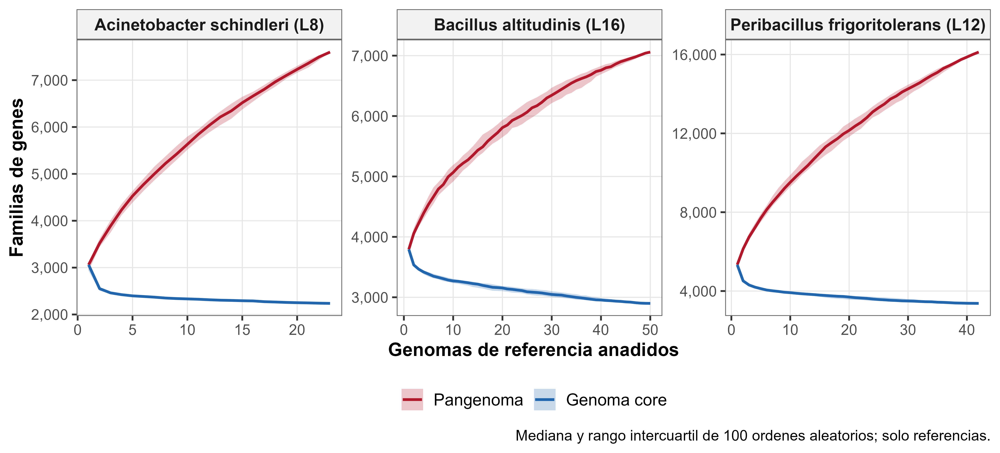

**Que muestra.** Cuantas familias se acumulan (rojo, pangenoma) y cuantas
siguen presentes en todos los genomas (azul, core) a medida que se agregan
referencias en orden aleatorio (100 ordenes; linea = mediana, banda = rango
intercuartil, es decir, el 50 % central de los valores).

**Como se lee.** Si la curva roja se aplana, el pangenoma esta cerrado; si
sigue subiendo, esta abierto. La azul baja y se estabiliza en el core.

**Resultado.** En las tres especies la curva roja sigue subiendo con el ultimo
genoma: los tres pangenomas son abiertos.

### Figura 2. Comparacion a igual numero de genomas

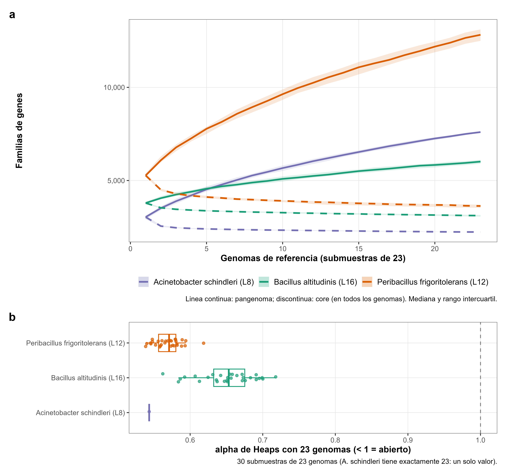

**Por que hace falta.** El pangenoma crece con el numero de genomas, y las
especies tienen 50, 42 y 23 referencias. Para comparar se tomaron
submuestras de 23 genomas (el N de *A. schindleri*).

**Panel a.** Curvas de pangenoma (continua) y core (discontinua) con 23
genomas. **Panel b.** alpha de Heaps en 30 submuestras distintas de 23.

| | Pangenoma con 23 | Core (en todos) con 23 | alpha con 23: mediana (rango) |
|---|---:|---:|---|
| *B. altitudinis* | ~6 000 | ~3 100 | 0,65 (0,56-0,72) |
| *P. frigoritolerans* | ~12 900 | ~3 580 | 0,57 (0,54-0,62) |
| *A. schindleri* | 7 599 | 2 237 | 0,54 |

**Resultado.** El orden se mantiene a igual N: *P. frigoritolerans* tiene de
verdad un pangenoma mucho mayor. alpha casi no cambia con N, pero depende de que
genomas entren: en *B. altitudinis* varia entre 0,56 y 0,72 segun la
submuestra. Conviene reportar el rango y no solo un valor.

### Figura 3. Espectro de frecuencias

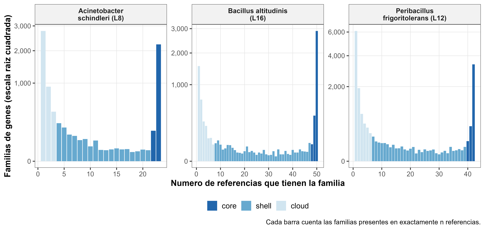

**Que muestra.** Cuantas familias estan en exactamente 1, 2, ..., N
referencias. Los pangenomas bacterianos suelen tener forma de U: muchas
familias raras a la izquierda, muchas universales a la derecha y pocas
intermedias (Horesh et al. 2021).

**Resultado.** Las tres especies tienen la forma en U. En *P. frigoritolerans*
la rama izquierda es mucho mas alta: 6 103 familias (38 %) estan en un solo
genoma, frente a 1 546 (22 %) en *B. altitudinis* y 2 782 (37 %) en
*A. schindleri*.

### Figura 4. Diagnostico de la ley de Heaps

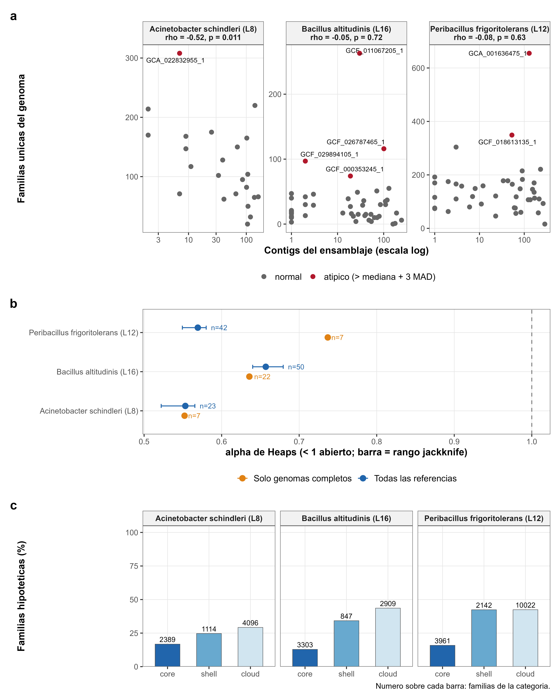

Comprueba si la apertura es real o esta inflada por genomas de mala calidad.

**Panel a. Genes unicos frente a fragmentacion.** Cada punto es una referencia:
cuantas familias tiene que ninguna otra referencia tiene (eje y) frente al
numero de contigs de su ensamblaje (eje x). Si los ensamblajes mas
fragmentados tuvieran mas genes unicos, la apertura vendria de genes partidos.
rho es la correlacion de Spearman (de -1 a 1; cerca de 0 = sin relacion).
- *B. altitudinis* rho = -0,05 y *P. frigoritolerans* rho = -0,08: sin
  relacion.
- *A. schindleri* rho = -0,52 (p = 0,01): relacion negativa, lo contrario de la
  inflacion.
- En rojo, genomas atipicos (mas de 3 desviaciones robustas sobre la mediana):
  4, 2 y 1. En *P. frigoritolerans* son GCA_001636475.1 (~650 familias propias)
  y GCF_018613135.1 (una cepa divergente revisada en el control de calidad,
  que se mantuvo).

**Panel b. alpha con y sin genomas en borrador.** Azul: alpha con todas las
referencias; la barra es el rango al quitar un genoma cada vez (jackknife): si
es estrecha, ningun genoma solo cambia el resultado. Naranja: alpha solo con
genomas completos (cerrados, sin fragmentacion).

| | alpha (todas) | rango jackknife | alpha (solo completos) |
|---|---|---|---|
| *B. altitudinis* | 0,66 (n = 50) | 0,64-0,68 | 0,64 (n = 22) |
| *P. frigoritolerans* | 0,57 (n = 42) | 0,55-0,58 | **0,74 (n = 7)** |
| *A. schindleri* | 0,55 (n = 23) | 0,52-0,57 | 0,55 (n = 7) |

**Panel c. Proteinas hipoteticas por categoria.** Porcentaje de familias sin
funcion conocida. Lo normal es que el cloud tenga mas; si fuera casi todo
hipotetico, sugeriria genes falsos. Aqui el core tiene 13-17 % y el cloud
29-45 %.

**Conclusion.** La apertura es real en las tres especies. En
*P. frigoritolerans* es algo menor de lo que sugiere el valor con todas las
referencias (0,74 con solo completos, aunque con 7 genomas la estimacion es
imprecisa): parte del tamano de su pangenoma viene de borradores y de los dos
genomas atipicos, y parte es real, porque la especie tiene linajes profundos
con repertorios distintos (seccion 8; ANI minimo entre referencias 95,8 %,
cerca del limite de especie). Se reportan ambos valores.

---

## 6. Donde cae cada cepa de la Estela dentro de su especie

### Figura 5. Posicion del bin en el pangenoma

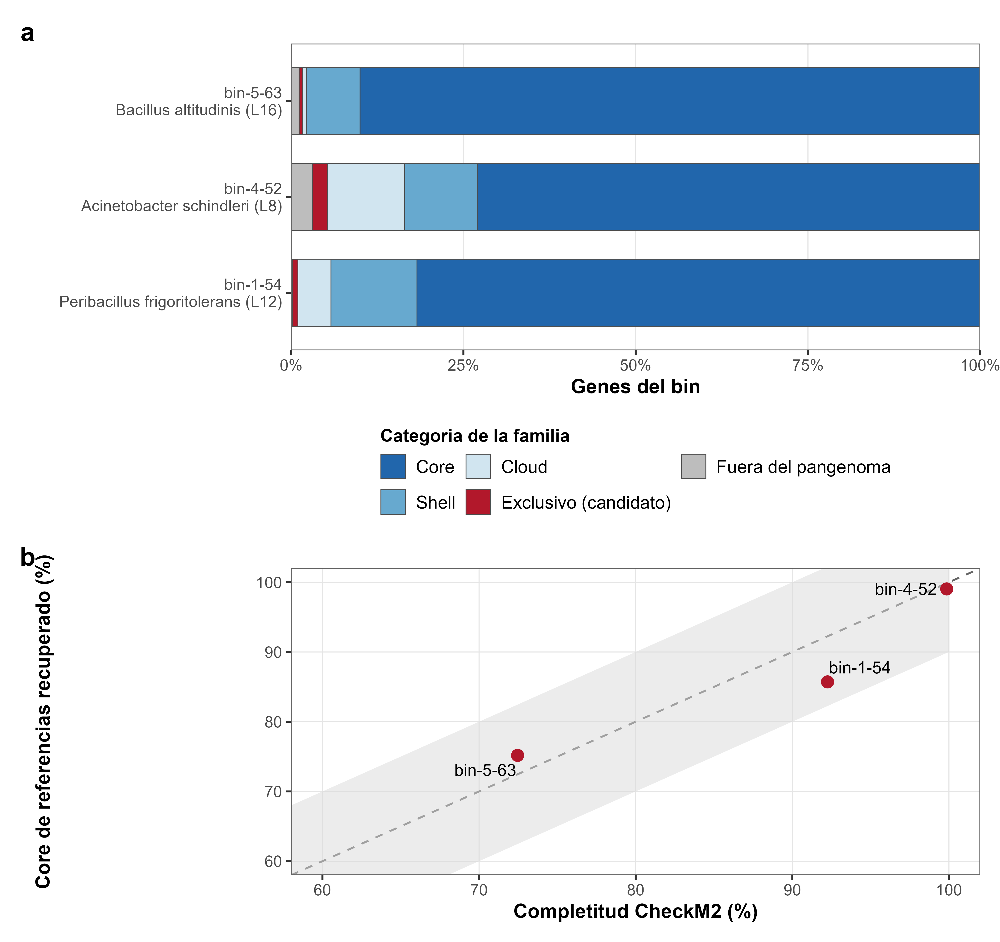

**Panel a.** Cada barra es el 100 % de los genes del bin, repartidos segun la
categoria de su familia en el pangenoma de referencias: core, shell, cloud,
candidato (familia sin referencias) o "fuera del pangenoma" (genes que Panaroo
elimino, seccion 9.3).

| Bin | Genes | Core | Shell | Cloud | Candidatos | Fuera del pangenoma |
|---|---:|---:|---:|---:|---:|---:|
| bin-5-63 | 2 739 | 2 465 | 213 | 15 | 14 | 32 |
| bin-1-54 | 4 167 | 3 406 | 520 | 200 | 34 | 7 |
| bin-4-52 | 3 266 | 2 383 | 345 | 367 | 70 | 101 |

**Panel b. Core recuperado frente a completitud.** Si el bin recupera del core
de las referencias aproximadamente el mismo porcentaje que su completitud, sus
ausencias se explican por incompletitud y no por un problema del analisis. La
banda gris es +/- 10 puntos.

| Bin | Completitud | Core recuperado |
|---|---:|---:|
| bin-5-63 | 72,5 % | 75,2 % |
| bin-1-54 | 92,3 % | 85,7 % |
| bin-4-52 | 99,9 % | 99,0 % |

Los tres quedan dentro de la banda: calcular la particion solo con
referencias funciona. Consecuencia: que un gen **este** en el bin es confiable;
que **falte**, no, sobre todo en bin-5-63.

### Figura 6. Genes propios frente a distancia al pariente mas cercano

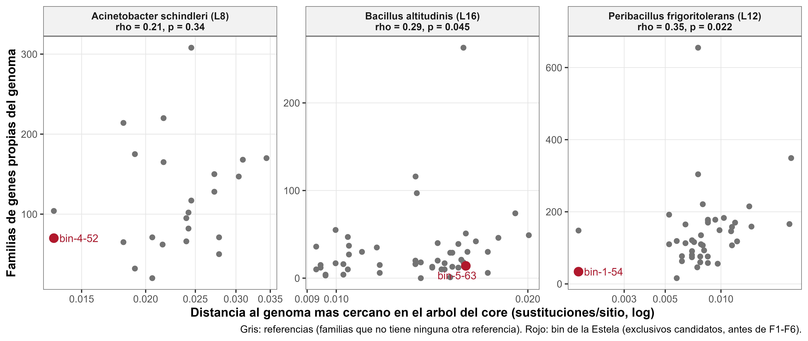

**Pregunta.** Tiene el bin "muchos" genes propios? Para cada referencia se
contaron las familias que ninguna otra referencia tiene (gris) y se
compararon con los candidatos del bin (rojo), frente a la distancia de cada
genoma a su pariente mas cercano en el arbol.

| | Referencias: mediana (rango) | Bin | Percentil del bin |
|---|---|---:|---:|
| *B. altitudinis* | 18 (0-263) | 14 | 34 |
| *P. frigoritolerans* | 120 (16-655) | 34 | 2 |
| *A. schindleri* | 104 (20-308) | 70 | 26 |

**Resultado.** Cualquier cepa de estas especies tiene genes propios, y los
bins estan dentro de lo tipico. Los genomas con un pariente mas lejano tienen
algo mas de genes propios (rho = 0,21-0,35). Tener genes "exclusivos" no indica
por si mismo adaptacion al ambiente de la Estela.

### 6.1 ANI de cada bin contra todos los genomas de su especie

Calculado con fastANI contra los 208, 69 y 29 genomas descargados
(`06c_ani_bins.slurm`).

| Bin | Genoma mas parecido | ANI | Lectura |
|---|---|---:|---|
| bin-1-54 (*P. frigoritolerans*) | GCA_900000145.1 (sin datos de origen) | **99,98 %** | Practicamente la **misma cepa**. Ademas 99,75 % con GCF_025142885.1 (piel humana, EE. UU.) y 99,74 % con GCF_024159205.1 (sala limpia, EE. UU.) |
| bin-5-63 (*B. altitudinis*) | GCF_900119345.1 y GCF_900188195.1 | 99,06 % | Miembro de un clon ya secuenciado. Esos dos genomas no estan en el pangenoma (la desreplicacion o el tope de 50 los dejaron fuera) |
| bin-4-52 (*A. schindleri*) | GCF_025514435.1 (clinica, EE. UU.) | 98,39 % | **Cepa distinta** de todas las secuenciadas (por debajo de 99 %) |

**El clon cosmopolita de *P. frigoritolerans*.** El pariente de bin-1-54 en
el arbol (GCA_024160055.1, suelo de Corea) representa un grupo de 8 genomas a
ANI >= 99 %: manzana podrida y suelo agricola (Alemania), semilla (Francia),
suelo (Corea), nieve (Antartida), sala limpia y piel humana (EE. UU.) y uno
sin datos. La cepa de la Estela es un miembro mas de ese clon, presente en 4
continentes y 6 ambientes. Eso explica que no tenga genes propios (seccion 9).

---

## 7. Arboles del genoma core

### Figuras 7-9. Arbol de cada especie

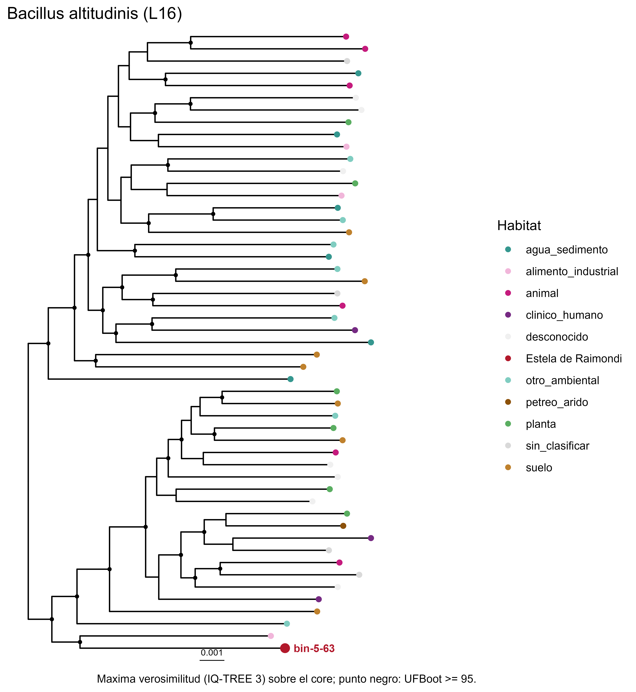

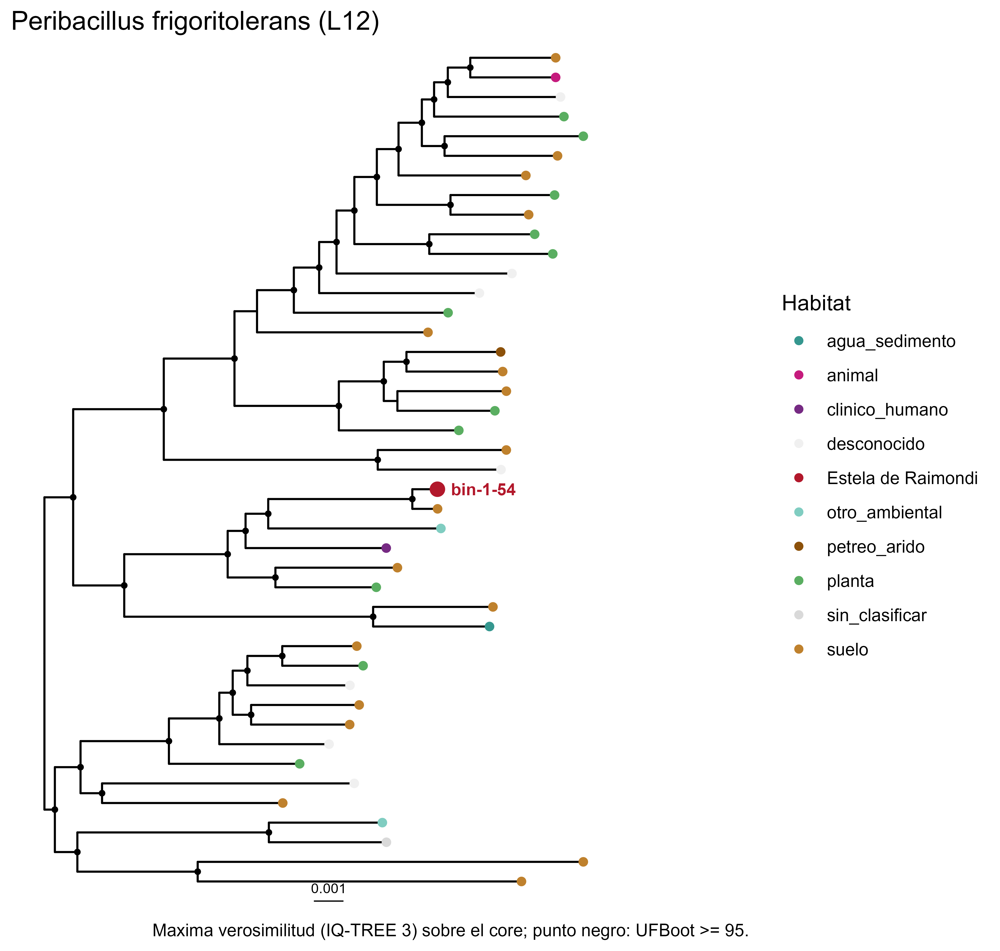

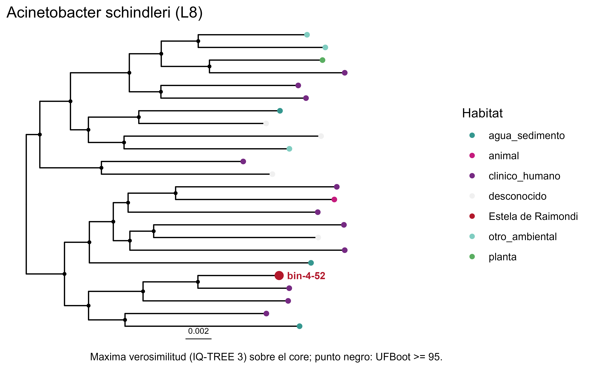

**Que muestran.** El parentesco entre el bin (rojo, grande) y las referencias,
calculado por maxima verosimilitud (el arbol que mejor explica las
diferencias observadas segun un modelo de evolucion) sobre el alineamiento de
los genes core. Color de cada punta = habitat de la referencia.

**Como se leen.** Dos puntas unidas cerca son cepas parecidas; el largo
horizontal de las ramas es la cantidad de cambios (barra de escala en
sustituciones por sitio). Punto negro en un nodo = UFBoot >= 95 (agrupamiento
confiable). La raiz se puso en el punto medio solo para dibujar; no indica el
ancestro real.

| | Secuencias | Sitios alineados | Sitios informativos | Modelo | Nodos con UFBoot < 95 |
|---|---:|---:|---:|---|---|
| *B. altitudinis* | 51 | 2,71 Mb | 132 634 | GTR+F+I+R5 | 18 de 48 |
| *P. frigoritolerans* | 43 | 3,24 Mb | 201 376 | GTR+F+R7 | 2 de 40 |
| *A. schindleri* | 24 | 2,04 Mb | 125 488 | GTR+F+R4 | 0 de 21 |

"Modelo" es el modelo de evolucion elegido automaticamente (ModelFinder).

**Posicion de cada bin** (todos con UFBoot 100):

| Bin | Pariente mas cercano | Distancia | Lectura |
|---|---|---:|---|
| bin-5-63 | GCF_000828455.1, cereales fermentados, Paises Bajos | 0,016 | Forman un grupo aparte del resto de la especie. La rama del bin (0,0083) mide casi lo mismo que la de su pariente (0,0077): la incompletitud no la alarga |
| bin-1-54 | GCA_024160055.1, suelo, Corea del Sur | **0,0017** | Practicamente la misma cepa en el core (seccion 6.1) |
| bin-4-52 | GCF_025514435.1, clinica, EE. UU. | 0,013 | Dentro de un grupo de cepas clinicas, coherente con el sesgo de las referencias |

**Confiabilidad.** La posicion de cada bin es solida. En *B. altitudinis*, 18
de 48 nodos tienen soporte bajo: las relaciones profundas de la especie estan
mal resueltas (ramas muy cortas, posible recombinacion, que no se corrigio).
Ninguna cepa de la Estela se agrupa con las referencias de ambientes petreos
(T1): el habitat del pariente mas cercano refleja que cepas se han
secuenciado, no el origen del bin.

---

## 8. Contenido accesorio, parentesco y habitat

### Figura 10. Ordenacion del genoma accesorio

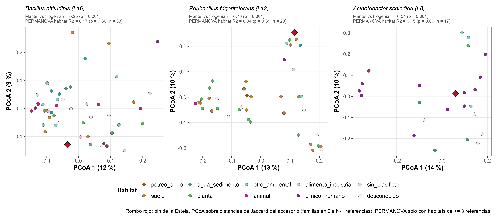

**Que muestra.** Una PCoA sobre la distancia de Jaccard (proporcion de
familias accesorias no compartidas entre dos genomas): genomas con accesorio
parecido quedan cerca. Color = habitat; rombo rojo = bin. Se excluyen los
singletons, que no aportan parecido entre genomas.

**Pruebas.**
- **Mantel:** si la distancia de contenido accesorio se correlaciona con la
  distancia en el arbol (r de -1 a 1).
- **PERMANOVA:** que fraccion de las diferencias de accesorio explica el
  habitat (R2), solo con habitats de al menos 3 referencias.

| | Mantel accesorio ~ arbol | PERMANOVA por habitat |
|---|---|---|
| *B. altitudinis* | r = 0,25, p = 0,001 | R2 = 0,17, p ~ 0,35 (38 genomas, 7 habitats) |
| *P. frigoritolerans* | r = 0,73, p = 0,001 | R2 = 0,04, p ~ 0,3 (28, 2) |
| *A. schindleri* | r = 0,54, p = 0,001 | R2 = 0,15, p ~ 0,06 (17, 3) |

### Figura 11. Matriz de presencia/ausencia junto al arbol

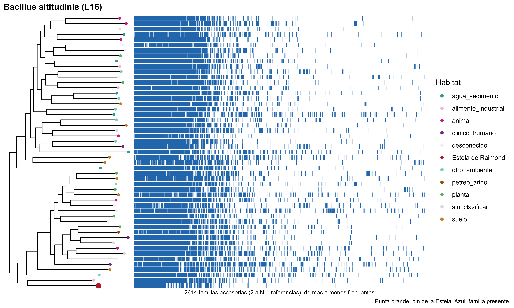
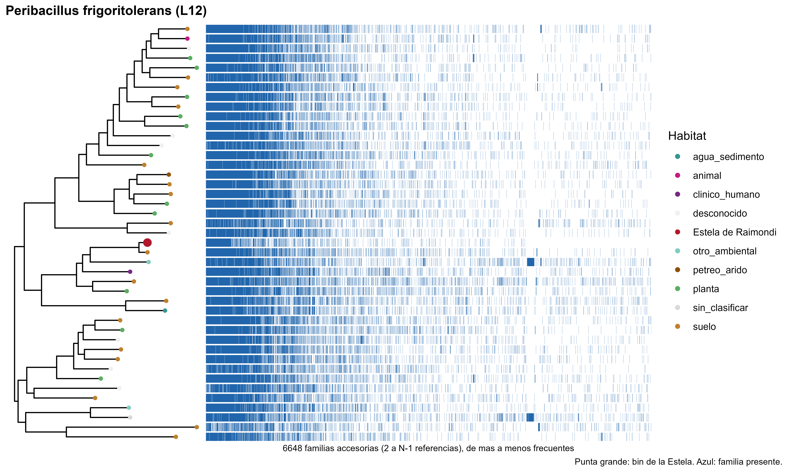
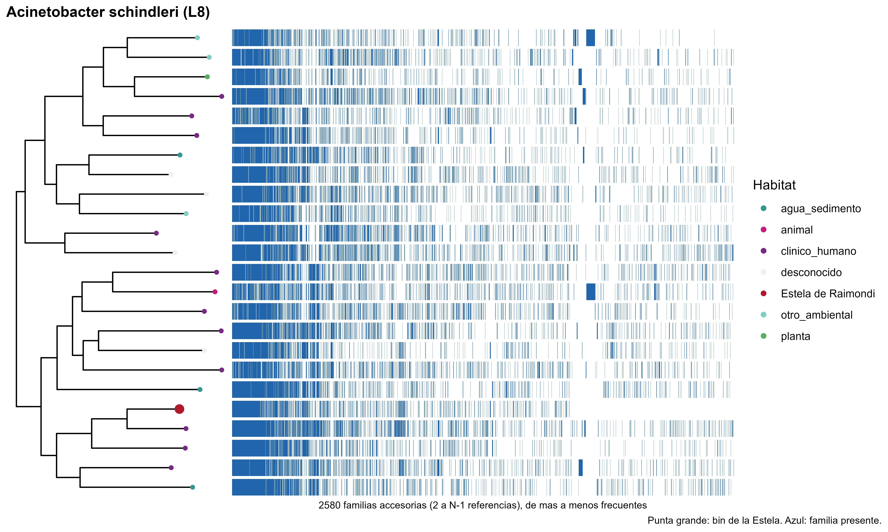

**Que muestra.** Cada fila es un genoma, en el orden del arbol, y cada columna
una familia accesoria (de la mas a la menos frecuente); azul = presente. Es la
figura estandar de los programas de pangenoma (Roary, Panaroo). Bloques de
familias compartidos por clados vecinos indican que el accesorio sigue al
parentesco.

**Resultado de la seccion.** Los genomas emparentados comparten accesorio; el
habitat no agrega una senal detectable, igual que en el grupo *B. pumilus*
(Fu et al. 2021). Advertencia: hay pocos genomas por habitat y los rotulos son
gruesos; "sin efecto detectable" no es "sin efecto". El pangenoma por si solo
no permite afirmar adaptacion al sustrato petreo.

---

## 9. Genes especificos de la cepa

### 9.1 Que significa "especifico de la cepa"

Un gen especifico de la cepa responde a una sola pregunta: **este gen del bin
de la Estela existe en algun otro genoma conocido de su especie?** Si no se
encuentra en ninguno (con los umbrales de la seccion 3.2), es especifico de la
cepa de la Estela frente a todo lo secuenciado hasta hoy.

No significa que el gen sea nuevo para la ciencia, ni que sea una adaptacion a
la piedra, ni que sea raro en la naturaleza: puede estar identico en otra
especie del mismo genero. La cantidad depende sobre todo de:
- **cuantos genomas hay de la especie** (F4 busco en 208, 69 y 29);
- **que tan cerca esta el pariente secuenciado mas proximo** (seccion 6.1);
- **la completitud del bin** (a bin-5-63 le falta ~25 %);
- **la biologia del genero:** *Acinetobacter* intercambia mucho ADN movil.

### 9.2 Primera corrida (v1) y correccion por ANI

La v1 uso F1-F6 sin F5b.

| | Candidatos | Descartados por F1 | por F4 | por F5 | Especificos v1 | Tras comprobar por ANI |
|---|---:|---:|---:|---:|---:|---:|
| *B. altitudinis* | 14 | 3 | 9 | 0 | 2 | **0** |
| *P. frigoritolerans* | 34 | 7 | 26 | 1 | 0 | **0** |
| *A. schindleri* | 70 | 14 | 20 | 6 | 30 | **27** |

**Por que F4 descarta tanto.** En *B. altitudinis*, 6 candidatos estaban en
representantes que no entraron por el tope de 50 y 3 en genomas eliminados por
la desreplicacion; en *P. frigoritolerans*, los 26 estaban en genomas
eliminados por la desreplicacion del mismo clon del bin (24 en uno solo,
GCA_900000145.1, el de ANI 99,98 %); en *A. schindleri*, 17 estaban en las
propias referencias con 80-97 % de identidad (integrasas, transposasas y
proteinas de fago que Panaroo separo en familias distintas). Sin F4, la lista
habria estado inflada por la desreplicacion y por como se agrupan los genes
moviles.

**La comprobacion por ANI.** F5 decidia "misma especie" por el nombre que
lleva el organismo en NCBI. Para cada gen especifico de la v1 se consulto el
IPG de su mejor parecido (341 genomas en total) y la especie de cada genoma
por su ANI contra las cepas tipo (`phase3_f5b_especie_por_ani.tsv`).

- Los 2 de *B. altitudinis* (una serina proteasa y una proteina con dominio
  DUF4342, de funcion desconocida) estan identicos en *Bacillus* sp. 22483
  (GCF_052044605.1), cuyo ANI es 98,3 % con *B. aerius*, sinonimo de
  *B. altitudinis*: la cepa contra la que NCBI mide ese ANI es nuestra
  referencia T0 GCF_029894105.1.
- 3 de *A. schindleri* (transportador de potasio, regulador AraC y
  polifosfato quinasa) estan identicos en *Acinetobacter* sp. 22323
  (GCF_052044895.1): ANI 97,75 % con la cepa tipo de *A. schindleri*.
- Ambas cepas son de rizosfera (suelo pegado a raices) en China, 2023,
  BioProject PRJNA1299421, publicadas el 13-08-2025, despues de GTDB R220.
- Se descarto la sospecha sobre "*Acinetobacter* sp. UBA2581" (un MAG con 5
  genes): su ANI es 97,6 % con *A. variabilis*, otra especie.

Esto motivo el filtro F5b, que hace esta comprobacion para todos los
parecidos de cada gen, no solo el mejor.

### 9.3 Genes que Panaroo habia eliminado

Panaroo, al limpiar el pangenoma, elimina genes poco respaldados, que trata
como posibles errores o contaminacion (Tonkin-Hill et al. 2020). Segun su
codigo (v1.8.0), en el modo usado (`moderate`) elimina todo gen que este en el
extremo de un contig y aparezca en menos de 2 genomas, y repite la poda hacia
adentro hasta encontrar un gen compartido. En los bins, 136 de los 140 genes
eliminados forman justamente tramos continuos desde el borde de un contig.

| | Genes eliminados | Contigs eliminados enteros |
|---|---:|---|
| *B. altitudinis* | 32 | 13 contigs cortos (1,5-3,4 kb; 26 kb en total), GC normal |
| *P. frigoritolerans* | 7 | 1 contig de 3,3 kb |
| *A. schindleri* | 101 | 4 contigs (40 kb, 34 genes); 3 con GC 0,35 frente a 0,42 del bin |

No es una falla de Panaroo: es un filtro pensado para pangenomas de aislados.
Pero va en contra de lo que aqui se busca: un gen especifico esta, por
definicion, en un solo genoma, y un MAG tiene muchos extremos de contig. Por
eso en la v1 el filtro de contigs huerfanos (F6) no recibio ninguno: Panaroo
ya los habia quitado. Un GC 7 puntos mas bajo que el del genoma es tipico de
ADN adquirido (plasmidos, fagos) o de contaminacion. Los 101 genes de
*A. schindleri* tienen largo normal (mediana 267 aa) y muchos son de sistemas
de defensa o elementos moviles (metiltransferasas de restriccion-modificacion,
helicasas, dinamina, dominios WYL).

### 9.4 Segunda corrida (v2): con los genes eliminados por Panaroo y F5b

Parte local terminada el 08-10; **parte remota (F5, F5b y F6) en curso**.

| | Candidatos (de ellos, eliminados por Panaroo) | Pasan F1 | Pasan F4 (van a F5) | Contigs huerfanos a F6 |
|---|---:|---:|---:|---:|
| *B. altitudinis* | 46 (32) | 25 | 14 | 6 |
| *P. frigoritolerans* | 41 (7) | 29 | 1 | 0 |
| *A. schindleri* | 171 (101) | 137 | 97 | 4 |

Los genes eliminados por Panaroo aportan 12 proteinas nuevas a F5 en
*B. altitudinis* y 61 en *A. schindleri*. **Resultado final: pendiente.**

### 9.5 Que son los genes especificos (resultados de la v1)

### Figura 12. Embudo de los filtros y origen

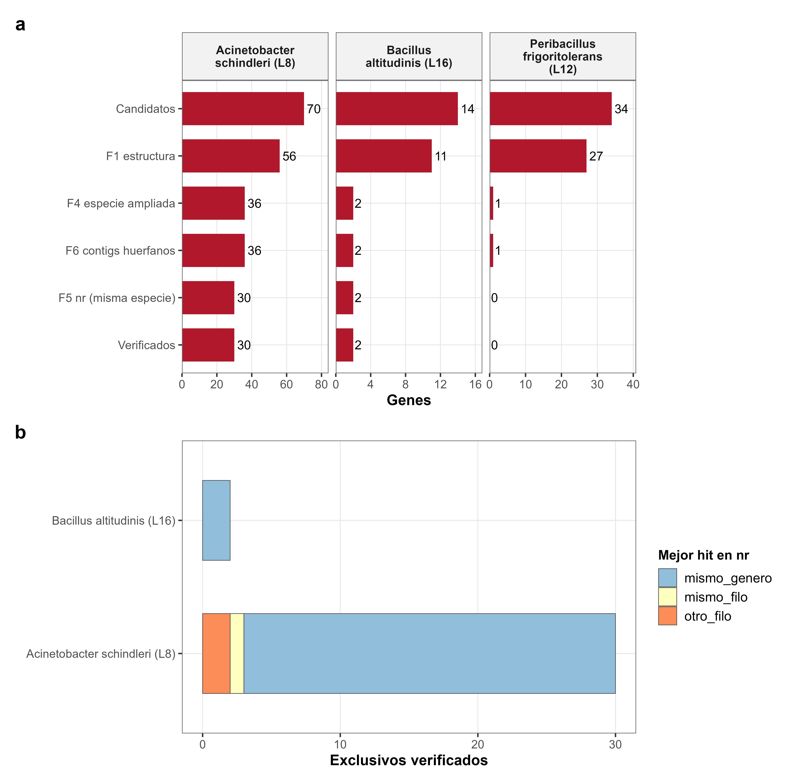

**Panel a.** Cuantos candidatos quedan despues de cada filtro. **Panel b.**
Origen probable segun el mejor parecido en nr: mismo genero, misma familia
taxonomica, mismo filo u otro filo; "sin parecido" (ORFan) si no hay ninguno.
(Figura de la v1; se regenera con la v2.)

### Figura 13. Contexto genomico

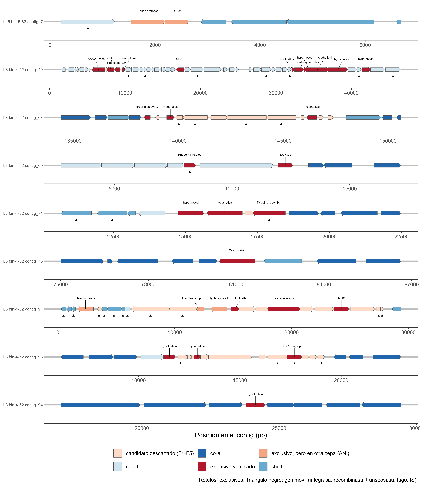

**Que muestra.** Los genes alrededor de cada gen especifico, como flechas en
su contig, coloreados por categoria; triangulo negro = gen movil (integrasa,
recombinasa, transposasa, fago, IS).

**Resultado (v1).**
- *B. altitudinis*: los 2 genes estan juntos al inicio de un contig, justo
  despues de una integrasa, seguidos por genes core de la especie: un elemento
  movil insertado. Son los que F5b mostro presentes en otra cepa de la
  especie.
- *A. schindleri*: los 27 genes estan en 8 contigs, en islas junto a
  integrasas, transposasas y proteinas de fago (profagos). Identidad del mejor
  parecido: >= 99 % en 16, 90-99 % en 7, < 90 % en 4. Origen: 24 en otras
  especies de *Acinetobacter* (*A. lwoffii*, *A. radioresistens*,
  *A. variabilis*, *A. johnsonii*...), 1 en un fago, 1 en *Cloacibacterium*
  (filo Bacteroidota, 99 %) y 1 en *Thauera* (55 %). Hipoteticas: 24 % de los
  candidatos frente a 8 % del genoma.

**Lectura.** Son genes adquiridos por transferencia horizontal, muchos de
forma reciente (identidad casi total con otras especies). Su relevancia para
el biodeterioro es una pregunta de la Fase 4.

### 9.6 Sensibilidad a la base de datos: NCBI frente a EBI

Por la saturacion de la cola de NCBI (hasta 7 h por especie) se corrio F5
tambien contra UniProtKB en el EBI. **No sirve como reemplazo:** UniProtKB
elimina proteomas redundantes y le faltan muchos genomas de generos muy
secuenciados.
- No encontro en la especie 7 genes que nr si encontro (1 en
  *P. frigoritolerans*, 6 en *A. schindleri*): con UniProtKB habrian pasado
  como especificos.
- En *B. altitudinis* asigno los 2 genes a otra familia y otro genero del
  filo (57-66 % de identidad), cuando nr tiene proteinas identicas en
  *B. subtilis*.

El resultado oficial es el de NCBI; el del EBI queda en `<especie>/ebi/`.

---

## 10. Lo que se puede afirmar y sus limites

**Se puede afirmar:**

1. Los pangenomas de las tres especies son abiertos, con un core de 2 400 a
   4 000 familias; la apertura se mantiene con el mismo numero de genomas y
   no se explica por la calidad de los ensamblajes.
2. Cada cepa de la Estela se ubica con soporte maximo junto a una cepa
   conocida de otro continente y otro ambiente. Ninguna se agrupa con las
   cepas de ambientes petreos.
3. La cepa de *P. frigoritolerans* de la Estela es practicamente identica (ANI
   99,98 %) a una cepa ya secuenciada y pertenece a un clon cosmopolita; la de
   *B. altitudinis* pertenece a un clon conocido (99,06 %); la de
   *A. schindleri* es una cepa distinta de las secuenciadas (98,39 %).
4. El contenido accesorio sigue al parentesco y no al habitat de aislamiento.
5. Las cepas de la Estela no tienen mas genes propios que cualquier otra cepa
   de su especie. Los genes especificos (cifra final pendiente) son en su
   mayoria ADN movil adquirido de otras especies del mismo genero.
6. La especificidad depende de la base de datos y de la definicion de
   especie: con UniProtKB en lugar de nr habrian pasado 7 genes mas, y con
   nombres de NCBI en lugar de ANI, 5 mas.

**Limites:**

- Los bins son MAG: la ausencia de un gen no es concluyente, sobre todo en
  bin-5-63 (72,5 %).
- Las referencias se limitan a GTDB R220; los genomas posteriores solo se
  revisan a traves de nr (F5 y F5b).
- F5 pidio 10 parecidos por proteina: una proteina compartida por cientos de
  genomas (por ejemplo MgtC, 210 genomas) puede tener una copia en la especie
  fuera de esos 10.
- Se excluyeron los MAG de las referencias y de F4 (8, 3 y 3 por especie).
- El arbol no corrige la recombinacion; las relaciones profundas de
  *B. altitudinis* estan mal resueltas.
- Pocos genomas por habitat: las pruebas de habitat tienen poca potencia.
- No se hizo una comparacion funcional de core frente a accesorio: Bakta anota
  la categoria COG solo en 4-31 % de los genes segun el genoma (y KEGG, EC o GO
  en 17-26 %), una cobertura demasiado baja y desigual. Se deja para la Fase 4.

---

## 11. Pendientes

- Terminar la parte remota de la v2 (F5 de las proteinas nuevas, F5b y F6 de
  los 10 contigs huerfanos) y actualizar las secciones 9.4-9.5, las figuras 12
  y 13 y la seccion 10.
- Figura del ANI de cada bin contra todos los genomas de su especie, con la
  exportacion final.

Archivos de esta fase en `results/fase3/` (tablas por especie en
`<especie>/`), figuras en `figuras/figs/` (scripts `figuras/R/f3_*.R`) y
tablas de las figuras en `figuras/tablas/`.

---

## 12. Referencias

- Brockhurst MA, et al. (2019). The ecology and evolution of pangenomes. *Curr Biol* 29(20):R1094-R1103. doi:10.1016/j.cub.2019.08.012
- Fu X, et al. (2021). *Bacillus pumilus* group comparative genomics: toward pangenome features, diversity, and marine environmental adaptation. *Front Microbiol* 12:571212. doi:10.3389/fmicb.2021.571212
- Guerra A. (2026). The pangenome: a statistical model, not a fixed biological property. *Bioinform Adv* 6(1):vbag069.
- Horesh G, et al. (2021). Different evolutionary trends form the twilight zone of the bacterial pan-genome. *Microb Genom* 7(9):000670. doi:10.1099/mgen.0.000670
- Li T, Yin Y. (2022). Critical assessment of pan-genomic analysis of metagenome-assembled genomes. *Brief Bioinform* 23(6):bbac413. doi:10.1093/bib/bbac413
- McInerney JO, McNally A, O'Connell MJ. (2017). Why prokaryotes have pangenomes. *Nat Microbiol* 2:17040. doi:10.1038/nmicrobiol.2017.40
- Tettelin H, et al. (2008). Comparative genomics: the bacterial pan-genome. *Curr Opin Microbiol* 11(5):472-477.
- Tonkin-Hill G, et al. (2020). Producing polished prokaryotic pangenomes with the Panaroo pipeline. *Genome Biol* 21:180. doi:10.1186/s13059-020-02090-4
